id: n8n-line-ai-agent
title: Build a Smart AI Chatbot without Coding using n8n
summary: สร้าง AI Chatbot บน LINE โดยไม่ต้องเขียนโค้ด โดยใช้ n8n self-hosted บน Render
authors: Punsiri Boonyakiat
categories: 
  - LINE Messaging API
tags: 
  - LINE Messaging API
  - n8n
  - AI Chatbot
status: Published


# Build a Smart AI Chatbot without Coding using n8n


## บทนำ
Duration: 0:05:00


"ในยุคที่ AI เข้ามามีบทบาทสำคัญ การสร้าง Chatbot ที่ 'ฉลาด' และ 'เข้าใจบริบท' ไม่จำเป็นต้องเขียนโค้ดที่ซับซ้อนอีกต่อไป"

ใน Codelab นี้ คุณจะได้เรียนรู้วิธีสร้าง LINE AI Chatbot แบบ Step-by-Step และที่สำคัญคือไม่ต้องเขียนโค้ดโดยใช้ Technology Stack ที่ทรงพลังและเริ่มต้นได้ฟรี:

- LINE: แพลตฟอร์มแชทที่เราคุ้นเคย ทำหน้าที่เป็นหน้าบ้าน (User Interface) สำหรับรับ-ส่งข้อความกับผู้ใช้งาน
- Google Gemini: ทำหน้าที่เป็น "สมอง" ในการประมวลผลภาษาและคิดคำตอบ
- n8n (Workflow Automation): เครื่องมือ Low-Code เพื่อเชื่อมต่อระบบต่างๆ เข้าด้วยกัน
- Render: Cloud Hosting สำหรับรัน n8n (Deployment)


### สิ่งที่คุณจะได้ลงมือทำ
- Deploy n8n ขึ้นบน Cloud (Render) ฟรี
- เชื่อมต่อ LINE Official Account เข้ากับ n8n
- สร้าง Workflow รับส่งข้อความอัตโนมัติ
- เชื่อมต่อ Google Gemini เพื่อให้บอทตอบคำถามได้อย่างเป็นธรรมชาติ

### สิ่งที่คุณจะได้เรียนรู้

- **เข้าใจระบบ**: เรียนรู้หลักการทำงานของ LINE Messaging API และ AI Automation

- **เตรียมความพร้อม**: สร้าง LINE OA และตั้งค่า Messaging API ให้พร้อมใช้งาน

- **ติดตั้งเครื่องมือ**: รู้จัก n8n และวิธี Deploy แบบ Self-hosted บน Render

- **เชื่อมต่อ**: สร้าง Webhook ด้วย n8n เพื่อรับ-ส่งข้อความกับผู้ใช้

- **สร้างบอท**: พัฒนา AI Chatbot ตัวแรกบน LINE ที่ใช้งานได้จริง

- **ปรับแต่ง AI**: เทคนิคการเขียนคำสั่ง (Prompt) ให้ AI เข้าใจบริบทและตอบโจทย์ธุรกิจ


### สิ่งที่คุณต้องเตรียมพร้อมก่อนเริ่ม Codelab 

- **แอปพลิเคชัน LINE บนสมาร์ทโฟน** ที่เข้าสู่ระบบเรียบร้อยแล้ว – สำหรับใช้สร้างและจัดการ LINE Official Account

- [**บัญชี Google**](https://accounts.google.com/lifecycle/steps/signup/) – สำหรับเข้าใช้งาน Google AI Studio เพื่อกดรับ Gemini API Key ในการเชื่อมต่อกับ AI

- **[บัญชี Render (สมัครฟรี)](https://dashboard.render.com/register)** – สำหรับใช้เป็น Server ในการ Deploy และรัน n8n


## ทำความรู้จักกับ LINE Messaging API
Duration: 0:10:00

### LINE Messaging API คืออะไร?
**LINE Messaging API** คือ API ที่ให้บริการโดย LINE Corporation ที่จะทำหน้าที่เป็นตัวกลางที่จะเชื่อมต่อ Server ของเราเข้ากับ LINE Official Account ทำให้เราสามารถเขียนโปรแกรมเพื่อสร้างบริการที่เราต้องการ ผ่านการข้อความและโต้ตอบกับผู้ใช้ในลักษณะ Chatbot ได้นั่นเอง โดยสามารถโต้ตอบกับผู้ใช้หลักๆได้ 2 แบบได้แก่ push และ reply
#### **Push messages**
   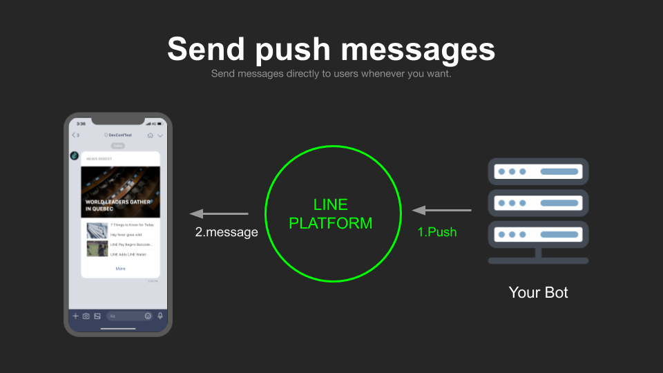
การส่งข้อความจาก Chatbot ไปหาผู้ใช้ โดยที่ผู้ใช้อยู่เฉยๆไม่ได้มีการ request อะไรมาที่ Chatbot (ลักษณะ One-way communication) เช่น Chatbot ส่งข้อความโปรโมชั่นไปหาผู้ใช้
#### **Reply messages**
   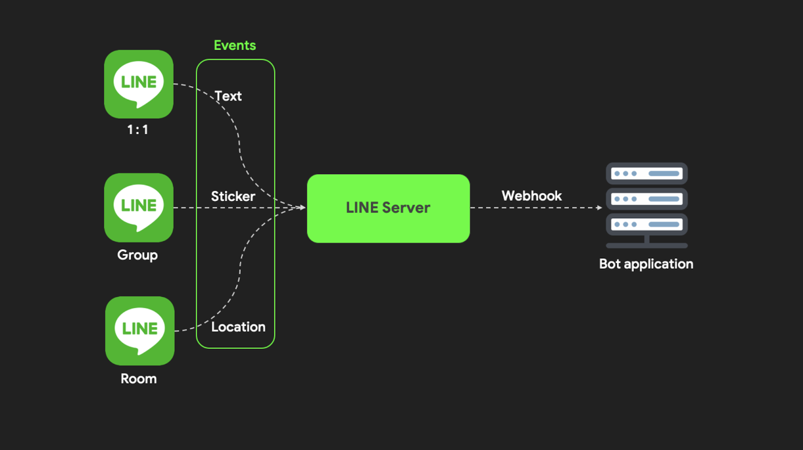
เป็นการโต้ตอบกับ Chatbot โดยผู้ใช้เป็นคน request มาที่ Chatbot ก่อนและตัว Chatbot ทำการตอบข้อความกลับไปหาผู้ใช้ เช่น ผู้ใช้ส่งข้อความเข้ามา หรือ ผู้ใช้ทำการ Add Chatbot เป็นเพื่อน (ผู้ใช้เป็นคนทักหา Account เราก่อน ลักษณะ Two-way communication)
### Webhook events คืออะไร?
**Webhook events**คือเหตุการณ์ event ต่างๆที่เกิดขึ้นกับ Chatbot ของเรา (event trigger) โดยเมื่อ event เกิดขึ้นแล้วจะมีสัญญาณพร้อมกับข้อมูลในรูปแบบที่เป็น JSON วิ่งมาที่ Webhook API ที่เราผูกไว้ ซึ่งภายใน JSON นั้นจะมี replyToken ที่ไว้สำหรับการ Reply messages เพื่อตอบกลับผู้ใช้ได้นั่นเอง
   

### การสร้าง Webhook Server ด้วย n8n

ภาพรวมการทำงานเมื่อนำ n8n มาใช้เป็น Webhook Server เพื่อประมวลผล Chatbot

ขั้นตอนการทำงานตามภาพประกอบ:

1. **LINE APP: ผู้ใช้งาน (User)**
   - เริ่มต้นการกระทำ เช่น ส่งข้อความ หรือเพิ่มเพื่อน

2. **LINE Platform (LINE Bot Platform)**
   - ทำหน้าที่เป็นตัวกลาง จัดการการรับส่งข้อความ
   - เมื่อมีเหตุการณ์ (Event) เกิดขึ้น จะทำการส่ง Webhook (ข้อมูล JSON) ไปยัง URL ของ Server ที่เรากำหนดไว้
   - รอรับ API requests จาก Server ของเรา เพื่อส่งข้อความตอบกลับ (Response) ไปยังผู้ใช้

3. **Webhook Server (n8n)**
   - ทำหน้าที่รอรับ Webhook events ที่ส่งมาจาก LINE Platform
   - นำข้อมูลที่ได้มาประมวลผลตาม Workflow ที่เราออกแบบไว้ใน n8n
   - เมื่อประมวลผลเสร็จ และต้องการตอบกลับ จะทำการส่ง API call กลับไปยัง LINE Messaging API เพื่อให้ LINE ส่งข้อความไปหาผู้ใช้


## สร้าง LINE OA และเปิดใช้งาน Messaging API
Duration: 0:15:00

### สร้าง LINE Official Account

จุดเริ่มต้นของการพัฒนา LINE Chatbot คือคุณจะต้องสร้าง LINE OA(LINE Official Account) และเปิดใช้งาน Messaging API

1. เข้าไปที่ [https://manager.line.biz](https://manager.line.biz) แล้วเลือก **Log in with LINE account** (สีเขียว) เพื่อเข้าสู่ระบบ

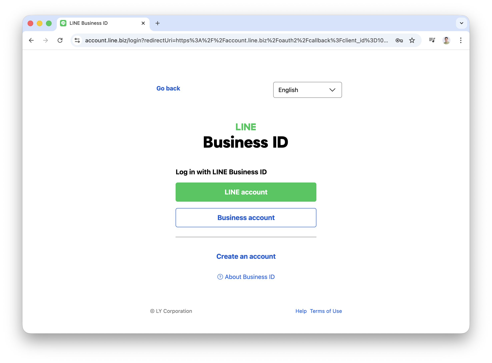

2. เข้าสู่ระบบด้วยบัญชี LINE ของคุณให้เรียบร้อย
3. กดสร้าง LINE OA จากปุ่ม **Create LINE official account** สำหรับผู้ที่สร้าง LINE OA ครั้งแรก หรือกด **Create new** ทางด้านซ้ายสำหรับผู้ที่เคยสร้าง LINE OA แล้ว
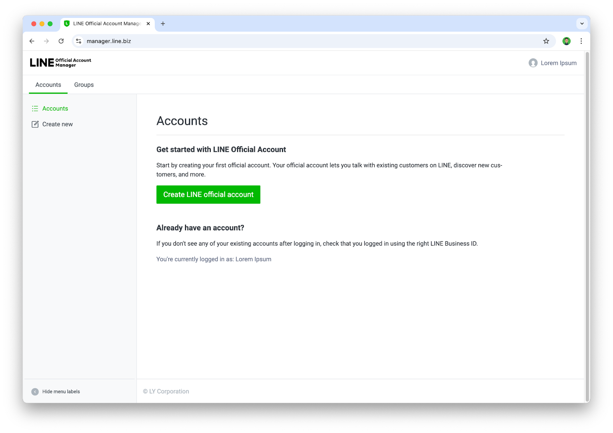
 4. ให้ระบุข้อมูลต่างๆ ลงไปในฟอร์ม แล้วกด **ตกลง**

5. จากนั้นให้ยืนยันรายละเอียดในการสร้าง LINE OA เป็นอันเสร็จสิ้น
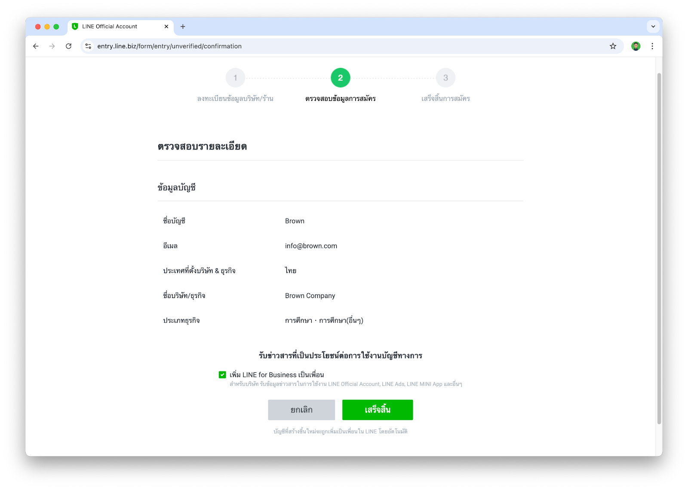


### เปิดใช้งาน Messaging API

หลังจากที่เรามี LINE OA เรียบร้อยแล้ว ขั้นตอนนี้จะพาทุกคนไปเพิ่มความสามารถให้ LINE OA ของเรากลายเป็น LINE Chatbot ได้

1. เข้าไปที่ [https://manager.line.biz](https://manager.line.biz) ในกรณีที่เรามีบัญชี LINE OA ที่สร้างไว้แล้ว หน้านี้จะแสดงบัญชี LINE OA ต่างๆ ที่เรามี ก็ให้เรากดเลือกบัญชี LINE OA ที่เราต้องการ

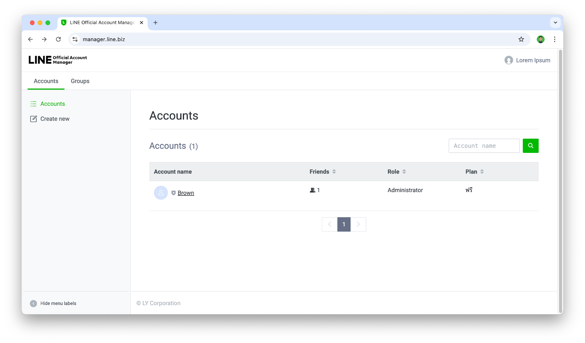

2. ให้เราไปที่เมนู **Settings > Messaging API** แล้วให้กดปุ่ม **Enable Messaging API**


3. หากเป็นการ Enable Messaging API ครั้งแรกของบัญชี LINE Business ID จะเจอหน้าให้ลงทะเบียน Developer info ก็ให้กรอก **ชื่อ** และ **อีเมล**

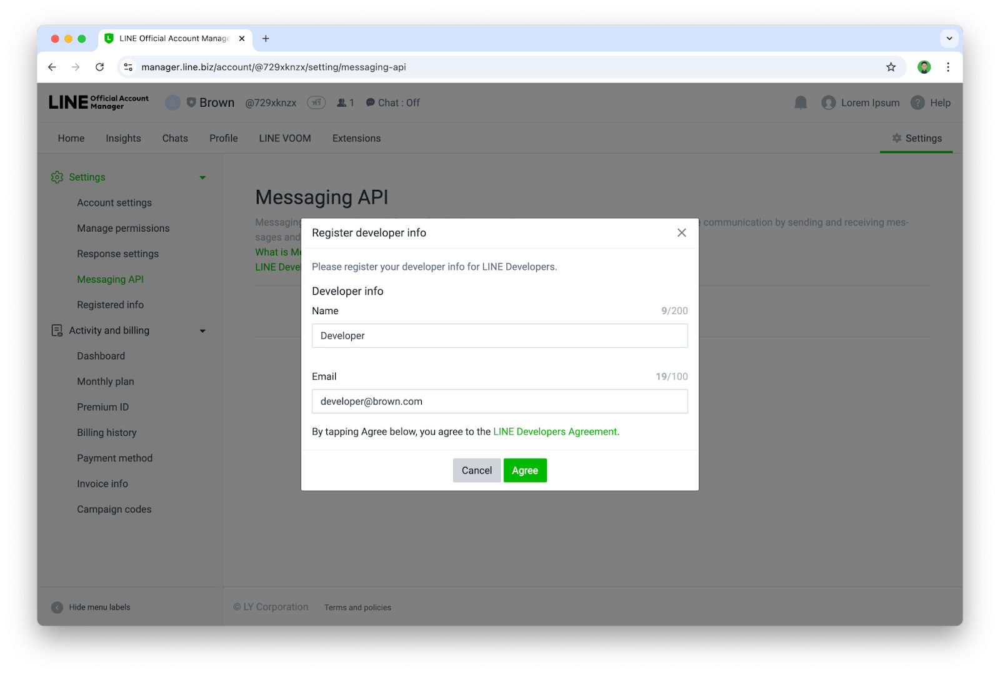

4. จากนั้นให้สร้าง Provider ใหม่ หรือเลือก Provider เดิมกรณีที่เคยสร้างไปแล้ว


<aside class="positive">
<strong>Note:</strong> Provider คือชื่อผู้ให้บริการ ซึ่งจะไปแสดงตามหน้า consent ต่างๆ ซึ่งถือเป็น superset ของ chatbot ทั้งหลายที่เราจะพัฒนาขึ้นรวมถึง LIFF app โดยเราสามารถระบุชื่อของ Provider เป็น ชื่อตัวเอง, ชื่อบริษัท, ชื่อทีม หรือชื่อกลุ่มก็ได้
</aside>

<aside class="negative">
<strong>Remember:</strong> 1 Account สามารถมี Provider สูงสุดได้ 10 Providers และไม่สามารถมีคำว่า LINE ในชื่อ Provider ได้
</aside>

5. ระบุ URL ของ **Privacy Policy** และ **Terms of Use** (ถ้ามี) หากยังไม่มีก็สามารถกดปุ่ม **ok** ข้ามไปได้


6. ยืนยันการเปิดใช้งาน Messaging API ด้วยการกด **Ok**


7. เมื่อเจอหน้านี้ ก็แปลว่าคุณได้เปิดใช้งาน Messaging API ให้กับบัญชี LINE OA เรียบร้อยแล้ว

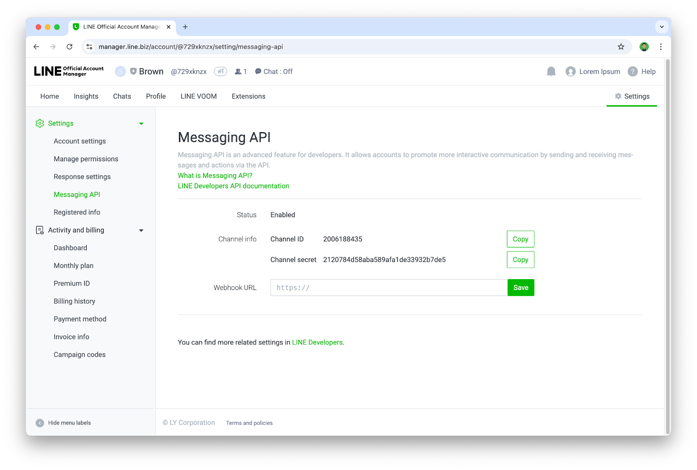

### เพิ่ม Chatbot เป็นเพื่อนและตั้งค่า Channel

ขั้นตอนนี้เราจะเข้าไปใช้งาน LINE Developers Console ซึ่งเป็นเว็บไซต์สำหรับการบริหารจัดการ LINE Chatbot(LINE OA ที่เปิดใช้งาน Messaging API แล้ว) ในส่วนของนักพัฒนา

1. เข้าไปที่ [https://developers.line.biz/console/](https://developers.line.biz/console/)
   ให้กดเลือก **Provider** ที่ต้องการ


2. เราจะพบกับบัญชี LINE OA ที่เราได้เปิดใช้งาน Messaging API ไว้ ซึ่งในที่นี้เราจะเรียกมันว่า **Channel** (Channel จะเปรียบเสมือน Chatbot หรือ App) ก็ให้กดเลือก **Channel** ที่ต้องการ

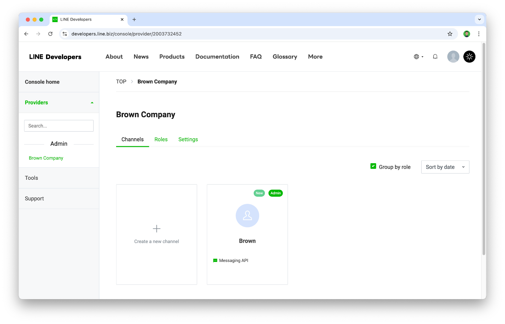

3. ให้ไปที่ Tab ชื่อ **Messaging API** และทำการแสกน **QR code** ด้วยแอป LINE เพื่อเพิ่ม Chatbot เป็นเพื่อน


4. ให้ปิด **Auto-reply messages** เนื่องจากฟีเจอร์นี้จะเป็น default การตอบกลับของ Chatbot ซึ่งไม่จำเป็นต้องใช้ฟีเจอร์นี้

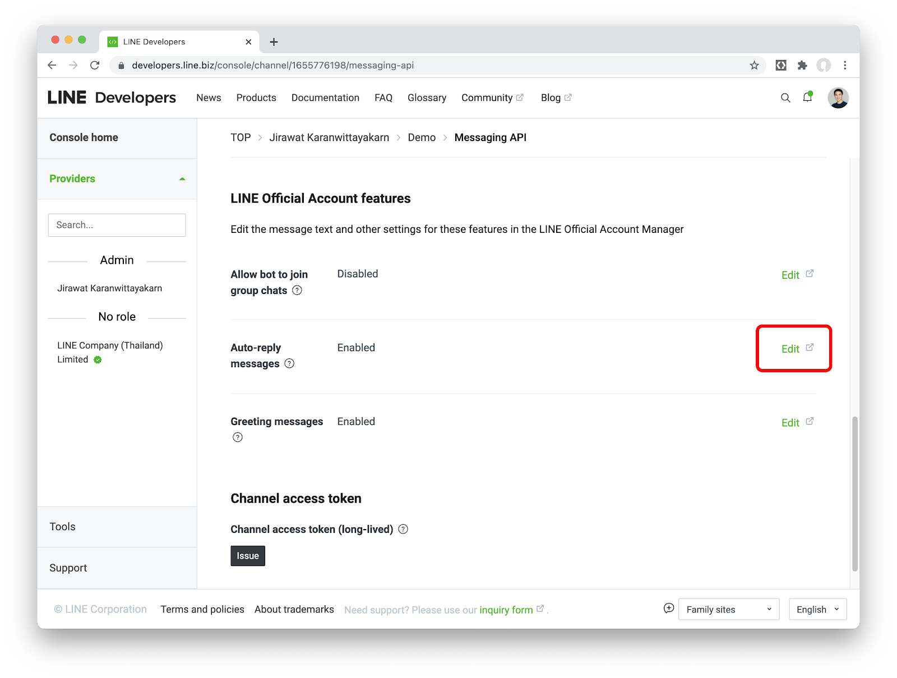


5. กลับมาที่ Channel ที่เราสร้างใน Tab ชื่อ **Messaging API** ตรงส่วนของ **Channel access token** ให้กดปุ่ม **Issue**

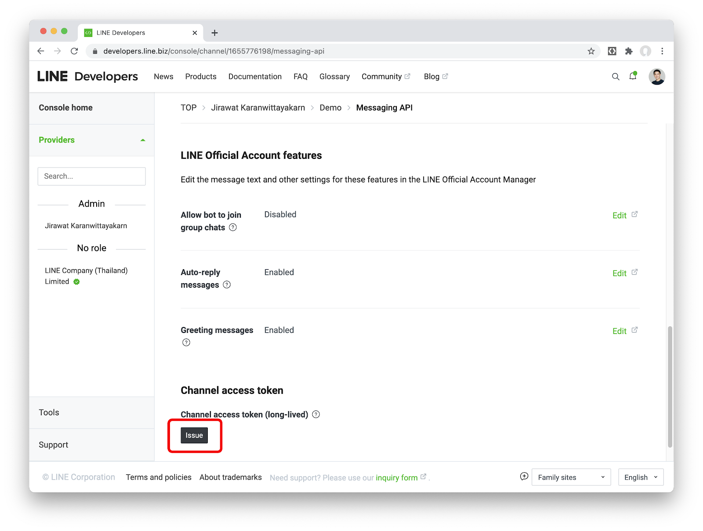

<aside class="negative">
<strong>Important:</strong> ตัว Channel Access Token คือกุญแจสำคัญในการใช้งาน Messaging API ดังนั้นให้เก็บรักษาไว้ให้ดี
</aside>


## ทำความรู้จักกับ n8n
Duration: 0:10:00

### n8n คืออะไร และเหมาะกับงานแบบไหน

**n8n** (pronounced "n-eight-n") เป็น open-source workflow automation tool ที่ช่วยให้คุณสามารถเชื่อมต่อ services และ APIs ต่างๆ เข้าด้วยกันได้โดยไม่ต้องเขียนโค้ดมาก

#### ฟีเจอร์หลัก

- **Visual Workflow Editor**: สร้าง workflow ด้วยการ drag-and-drop
- **400+ Integrations**: เชื่อมต่อกับ services มากมาย (Google, Slack, GitHub, Database, APIs)
- **Self-hosted**: สามารถ host เองได้ (ฟรี) หรือใช้ n8n Cloud (paid)
- **Extensible**: เขียน custom nodes ได้ด้วย JavaScript/TypeScript
- **Workflow Templates**: มี templates สำเร็จรูปให้ใช้

#### เหมาะกับงานแบบไหน?

1. **Automation Tasks**
   - จัดการข้อมูลระหว่าง services
   - สร้าง reports อัตโนมัติ
   - Sync ข้อมูลระหว่าง systems

2. **API Integration**
   - เชื่อมต่อ APIs หลายตัวเข้าด้วยกัน
   - Transform และ enrich ข้อมูล
   - สร้าง API endpoints ใหม่

3. **Chatbots & AI Agents**
   - สร้าง chatbot สำหรับ messaging platforms
   - เชื่อมต่อกับ AI/LLM services
   - จัดการ conversation flow

4. **Data Processing**
   - Process และ transform ข้อมูล
   - ส่งข้อมูลไปยัง database
   - สร้าง data pipelines

5. **Notifications & Alerts**
   - ส่งการแจ้งเตือนเมื่อมี event เกิดขึ้น
   - สร้าง monitoring workflows
   - Integrate กับ notification services


### แนวคิด Workflow-based Automation

#### Workflow คืออะไร?

**Workflow** คือลำดับของ steps (nodes) ที่ทำงานต่อเนื่องกัน โดยแต่ละ node จะ:
- รับข้อมูลจาก node ก่อนหน้า
- ประมวลผลข้อมูล
- ส่งข้อมูลไปยัง node ถัดไป

### ตัวอย่าง Workflow

```text
Webhook (รับข้อความ)
   ↓
IF (ตรวจสอบประเภทข้อความ)
   ↓ (True)
Set (เตรียมข้อมูล)
   ↓
AI Agent (ประมวลผลด้วย AI)
   ↓
HTTP Request (ส่งข้อความกลับ)
```

#### ประเภทของ Nodes

1. **Trigger Nodes**: เริ่ม workflow (Webhook, Schedule, Manual Trigger)
2. **Action Nodes**: ทำ action ต่างๆ (HTTP Request, Database, Email)
3. **Logic Nodes**: ควบคุม flow (IF, Switch, Merge)
4. **Data Nodes**: จัดการข้อมูล (Set, Code, Function)
5. **AI Nodes**: เชื่อมต่อกับ AI services (OpenAI, Anthropic)

### ข้อดีของ Workflow-based

- **Visual**: เห็น flow ทั้งหมดได้ชัดเจน
- **No Code / Low Code**: ไม่ต้องเขียนโค้ดมาก
- **Reusable**: สามารถ reuse workflows และ nodes
- **Debuggable**: ดูข้อมูลในแต่ละ step ได้ง่าย
- **Maintainable**: แก้ไขและปรับปรุงได้ง่าย


**เหมาะกับใคร?**
- **n8n**: เมื่อต้องการ self-hosted และ open source
- **Make**: เมื่อต้องการ visual editor ที่ดีมากและ error handling ที่ยอดเยี่ยม
#### สรุป: ทำไมเลือก n8n?

1. **Self-hosted ฟรี**: ไม่มีค่าใช้จ่ายสำหรับ self-hosted
2. **Open Source**: สามารถปรับแต่งและ extend ได้
3. **Flexibility**: เชื่อมต่อกับ services มากมาย
4. **Control**: ควบคุมข้อมูลและ infrastructure ได้เต็มที่
5. **Cost-effective**: ประหยัดเมื่อเทียบกับ SaaS solutions


## ใช้งาน n8n แบบ Self-host บน Render
Duration: 0:20:00

เราจะ deploy n8n บน Render โดยใช้ Docker image ที่มีอยู่แล้ว ซึ่งเป็นวิธีที่ง่ายและเร็วที่สุด

### ขั้นตอนทั้งหมด

1. เข้าสู่ระบบ Render Dashboard
2. สร้าง Web Service บน Render
3. ตั้งชื่อ Service และเลือก Plan
4. ตั้งค่า Environment Variables และ Deploy Service
5. เริ่มต้นใช้งาน n8n บน Render

---

### ขั้นตอนที่ 1: เข้าสู่ระบบ Render Dashboard

1. ไปที่ [Render Register](https://dashboard.render.com/register)
2. ในหน้าการเข้าสู่ระบบ **Create an account** ให้เลือกเข้าสู่ระบบด้วย Google เพื่อใช้บัญชี Google ของคุณ
   
3. เลือกบัญชี Google ที่ต้องการใช้สำหรับเข้าสู่ระบบ
   
4. เมื่อเข้าสู่ระบบสำเร็จ ระบบจะพาคุณไปยังหน้า Render Dashboard
   

### ขั้นตอนที่ 2: สร้าง Web Service บน Render

1. ที่หน้า Render Dashboard ให้ดูที่หัวข้อ **Web Services** แล้วคลิกปุ่ม **"New Web Service"** (หรือคลิก **"New +"** ที่มุมขวาบนแล้วเลือก **Web Service**)
   

2. ในหน้าถัดมา หัวข้อ **Source Code** ทางด้านขวา:
   - เลือกแท็บ **"Existing Image"**
   - ในช่อง **Image URL** ให้พิมพ์หรือวางโค้ด: `n8nio/n8n:latest`
   - คลิกปุ่ม **"Connect"**
   

### ขั้นตอนที่ 3: ตั้งชื่อ Service และเลือก Plan

1. **Name**: ตั้งชื่อ Service ของคุณ (เช่น `my-first-n8n-server-2026`)
2. **Region**: เลือกภูมิภาคของเซิร์ฟเวอร์ที่ใกล้ที่สุด (แนะนำ Singapore เพื่อความเร็วในการเชื่อมต่อจากไทย)
3. **Instance Type**:
   - เลือก **Free** สำหรับการทดสอบ

<aside class="negative">
<strong>Important:</strong> Instance Type แบบฟรีจะหยุดทำงานเมื่อไม่มีการใช้งาน และจะทำให้การเรียกใช้งานครั้งแรกล่าช้า 50 วินาทีหรือมากกว่า
</aside>

<aside class="positive">
<strong>Tip:</strong> แนะนำใช้แผน Starter สำหรับ production เพื่อความเสถียรและไม่ sleep
</aside>


### ขั้นตอนที่ 4: ตั้งค่า Environment Variables

1. คลิกที่ปุ่ม **"Advanced"** และเลือก **"Add Environment Variable"**
2. เพิ่ม Environment Variables ตามตารางด้านล่าง:

    | **Key** | **Value** | **Description** |
    | :--- | :--- | :--- |
    | `N8N_PROTOCOL` | `https` | Protocol สำหรับ webhook |
    | `WEBHOOK_URL` | `https://[ชื่อแอปของคุณ].onrender.com/` | Webhook URL สำหรับ n8n เช่น `https://my-first-n8n-server-2026.onrender.com/` |

3. หลังจากนั้นให้กดปุ่ม **"Create Web Service"** (หรือ **Deploy Web Service**)
   

4. รอจนกว่า Deployment จะเสร็จสมบูรณ์ (ประมาณ 2-5 นาที)
   

5. หลังจาก Deploy เสร็จ ให้เปิด URL ด้านบนซ้ายเพื่อเริ่มต้นใช้งาน n8n
   

### ขั้นตอนที่ 5: เริ่มต้นใช้งาน n8n บน Render

1. **ตั้งค่าบัญชีผู้ดูแลระบบ (Owner Account)**
   เมื่อเปิด URL ขึ้นมาครั้งแรก จะปรากฏหน้า **Set up owner account** ให้กรอกข้อมูลเพื่อสร้างบัญชี Admin:
   - **Email**: อีเมลของคุณ
   - **First Name / Last Name**: ชื่อและนามสกุล
   - **Password**: ตั้งรหัสผ่าน (ต้องมีอย่างน้อย 8 ตัวอักษร, ตัวเลข, และตัวพิมพ์ใหญ่)
   
   คลิกปุ่ม **"Next"**
   

2. ระบบจะสอบถามข้อมูลการใช้งานเบื้องต้น (เช่น บทบาทของคุณ, ขนาดบริษัท) ให้เลือกคำตอบที่ตรงกับคุณ
   
   คลิกปุ่ม **"Get started"**
   

3. เมื่อเข้าสู่หน้า Dashboard หลัก จะพบข้อความต้อนรับ **Welcome [ชื่อของคุณ]!**
   คุณสามารถคลิกที่ **"Start from scratch"** เพื่อเริ่มสร้าง Workflow แรกได้ทันที
   

## สร้าง LINE Webhook Node บน n8n และเชื่อมต่อกับ LINE Chatbot
Duration: 0:15:00

เราจะตั้งค่า n8n ให้รับข้อความจาก LINE โดยใช้ Node **"Line Messaging"** (ต้องติดตั้งเพิ่ม) ซึ่งจะจัดการเรื่อง Webhook ให้เราโดยอัตโนมัติ 

### ขั้นตอนทั้งหมด
1. สร้าง Workflow ใหม่
2. ติดตั้งและเพิ่ม Node Line Messaging
3. ตั้งค่าการเชื่อมต่อ (Credentials)
4. เพิ่ม Reply Node
5. ตั้งค่า Webhook URL ใน LINE
6. ทดสอบผ่าน LINE บนมือถือ
7. ตรวจสอบการทำงานของ Workflow บน n8n

---

### ขั้นตอนที่ 1: สร้าง Workflow ใหม่

1. เมื่อเข้าสู่หน้า Dashboard คลิกที่การ์ด **"Start from scratch"**
   
   คุณจะได้หน้า Canvas ว่างๆ พร้อมสำหรับเริ่มงาน

### ขั้นตอนที่ 2: ติดตั้งและเพิ่ม Node Line Messaging
เนื่องจาก Node ของ LINE ไม่ได้มีติดมากับตัวตั้งต้น เราต้องทำการติดตั้งผ่าน Community Nodes ก่อน

1. คลิกปุ่ม **"+"** (Add first step) หรือปุ่มบวกมุมขวาบน
   
2. ในช่องค้นหา พิมพ์ว่า `LINE`
   
3. คุณจะเห็น "Line Messaging" ให้คลิกเลือก จะปรากฏหน้าต่างรายละเอียด Node ให้กดปุ่ม **"Install node"**
   
4. เมื่อติดตั้งเสร็จ ในส่วนของ Trigger เลือก **On all**
   

### ขั้นตอนที่ 3: ตั้งค่าการเชื่อมต่อ (Credentials)

1. ที่ช่อง **Credential to connect with** ให้เลือก **"Create new credential"**
   
2. นำข้อมูลจาก LINE Developers Console มากรอก:
   - **Channel Access Token**
   - **Channel Secret**
   
   เมื่อกรอกครบกด **Save**
   
   
   
   

### ขั้นตอนที่ 4: เพิ่ม Reply Node

1. จาก Node Line Messaging Trigger กด **+** เพื่อเพิ่ม Node ใหม่ที่เป็นการตอบกลับข้อความจาก LINE
   
2. เลือก **"Reply to a message using a reply token"**
   
3. ตั้งค่า **Reply Token** และ **Text**
   - ในช่อง Reply Token ให้ใส่ค่า: `{{ $("Line Messaging Trigger").item.json.replyToken }}`
   - ในส่วนของการตอบกลับ ให้กดปุ่ม **"Add Message"** แล้วพิมพ์ข้อความที่ต้องการ
   

### ขั้นตอนที่ 5: ตั้งค่า Webhook URL ใน LINE

1. ในหน้าตั้งค่า Node ส่วนของ **Webhook URLs** ให้คลิกเลือก **"Production URL"**
   
2. คลิกที่ URL เพื่อคัดลอก (จะเป็น `https://[ชื่อแอป].onrender.com/webhook/...`)
   
3. กดปุ่ม **Save** มุมขวาบนแล้วตั้งชื่อ Workflow จากนั้นกด **Publish** (หรือเปิดสวิตช์ Active)
    
    
   <aside class="positive">
    <strong>สำคัญ:</strong> ต้องกด **Publish** ให้สถานะเป็นสีเขียว เพื่อให้ Bot ทำงานได้จริงเมื่อเชื่อมต่อ
   </aside>
   
4. นำ URL ที่คัดลอกไว้ ไปวางในช่อง **Webhook settings** ที่หน้า LINE Developers Console แล้วกด **Verify**
    
5. เมื่อ Verify ผ่าน ให้กดเปิดสวิตช์ **Use webhook**
    

### ขั้นตอนที่ 6: ทดสอบผ่าน LINE บนมือถือ
จะเห็นได้ว่า n8n workflow นี้สามารถตอบกลับเป็นข้อความอัตโนมัติได้

### ขั้นตอนที่ 7: ตรวจสอบการทำงานของ Workflow บน n8n
<aside class="positive">
<strong>Tip:</strong> ใช้ n8n Execution Log เพื่อ debug และดูข้อมูลที่ผ่านแต่ละ node
</aside>

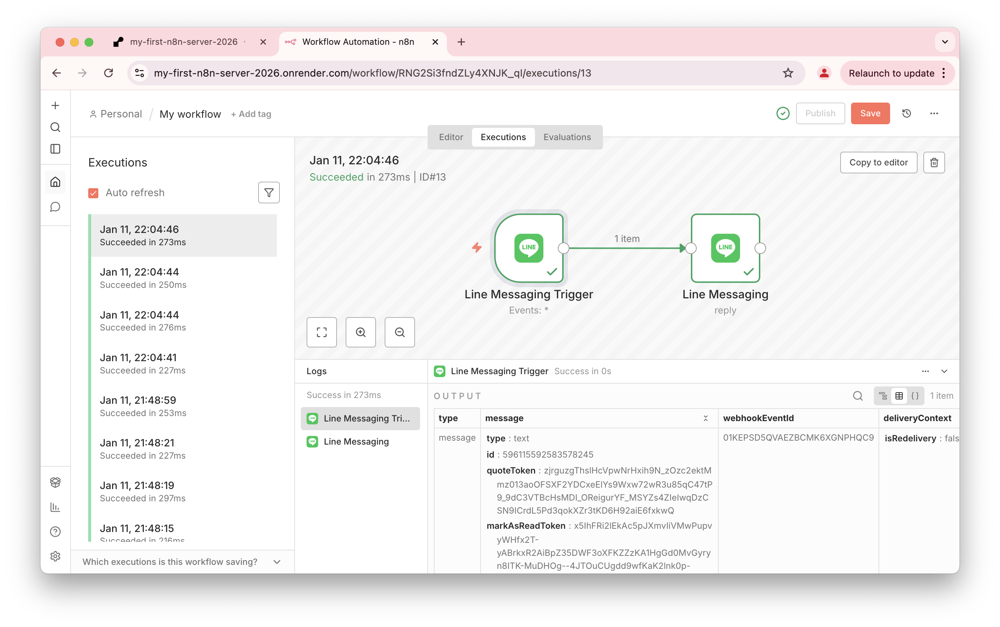


## ทำความรู้จัก AI Agent
Duration: 0:15:00

AI Agent คือระบบบอทที่มีความสามารถสูงกว่า Chatbot ทั่วไป โดยใช้เทคโนโลยี AI และ LLM (Large Language Model) เป็นแกนหลักในการประมวลผล ทำให้มีความสามารถในการทำความเข้าใจภาษาและบริบทที่ซับซ้อน ได้แก่:
- **เข้าใจความหมาย (Understand Meaning):** สามารถตีความเจตนาของผู้ใช้งานได้ แม้ว่าจะมีการใช้คำศัพท์หรือรูปประโยคที่หลากหลาย
- **ตอบตามบริบท (Context Aware):** สามารถจดจำและเชื่อมโยงข้อมูลจากการสนทนาก่อนหน้า ทำให้การโต้ตอบมีความต่อเนื่องและเป็นธรรมชาติ

### องค์ประกอบหลักของ AI Agent
โครงสร้างการทำงานของ AI Agent ประกอบด้วย 4 ส่วนสำคัญ คือ:
1. **LLM Model:** โมเดลภาษาที่เป็นหน่วยประมวลผลหลักและคลังความรู้
2. **Instruction:** คำสั่งกำกับดูแลเพื่อกำหนดพฤติกรรมของ Agent
3. **Memory:** หน่วยความจำสำหรับเก็บประวัติการสนทนา เข้าใจความต่อเนื่องของบทสนทนา
4. **Tools:** เครื่องมือสำหรับเชื่อมต่อกับระบบภายนอกเพื่อทำภารกิจต่างๆ

---

### เจาะลึก: Instruction และ Prompt

Instruction (หรือ System Prompt) คือส่วนประกอบที่สำคัญที่สุดในการกำหนดบุคลิกและการทำงานของ AI Agent เปรียบเสมือนชุดคำสั่งที่ระบุขอบเขตความรับผิดชอบ เพื่อให้ LLM ทำงานได้ตรงตามวัตถุประสงค์

การเขียน Instruction ที่ดีสำหรับ AI Agent ควรกำหนดหัวข้อต่อไปนี้ให้ชัดเจน:
* **Persona:** กำหนดบทบาทว่า Agent คือใคร (เช่น เจ้าหน้าที่ Support, ผู้เชี่ยวชาญเฉพาะด้าน)
* **Objective:** ระบุเป้าหมายหลักของการทำงาน (เช่น การตอบคำถาม, การปิดการขาย)
* **Constraints:** กำหนดข้อจำกัดหรือสิ่งที่ห้ามทำ (เช่น ห้ามตอบนอกเหนือข้อมูลที่มี, ห้ามใช้ภาษาที่ไม่สุภาพ)


### ความสามารถเสริม: Context และ Tool Calling


**Tool Calling (Function Calling)**  คือความสามารถของ AI ในการเลือกใช้เครื่องมือหรือฟังก์ชันเพื่อกระทำสิ่งต่างๆ นอกเหนือจากการคุยตอบโต้ปกติ เช่น:
* **ค้นหาข้อมูล:** เรียก API เพื่อดึงข้อมูล Real-time
* **คำนวณ:** ใช้ฟังก์ชันทางคณิตศาสตร์หรือตรรกะที่ซับซ้อน
* **บันทึกข้อมูล:** เชื่อมต่อ Database เพื่อบันทึกสถานะ

### ตัวอย่าง Use Case ของ AI Agent

การกำหนด Instruction ที่แตกต่างกัน จะทำให้ได้ AI Agent ที่มีหน้าที่แตกต่างกันอย่างสิ้นเชิง ดังตัวอย่างต่อไปนี้:

#### 1. Customer Service Agent
* **Instruction:** กำหนดบทบาทเป็นเจ้าหน้าที่บริการลูกค้า ให้ข้อมูลด้วยความสุภาพและถูกต้องตามนโยบาย
* **การทำงาน:** ตอบคำถามเกี่ยวกับสินค้า แก้ไขปัญหาเบื้องต้น และให้คำแนะนำการใช้งาน

#### 2. E-commerce Shopping Assistant
* **Instruction:** กำหนดบทบาทเป็นผู้ช่วยช้อปปิ้ง แนะนำสินค้าโดยวิเคราะห์จากความต้องการของผู้ใช้
* **การทำงาน:** สอบถามสไตล์ที่ชอบ แนะนำสินค้าที่เกี่ยวข้อง และช่วยเปรียบเทียบคุณสมบัติ

#### 3. Appointment Booking Agent
* **Instruction:** กำหนดบทบาทเป็นเจ้าหน้าที่รับจองคิว ตรวจสอบตารางเวลาว่างและยืนยันนัดหมาย
* **การทำงาน:** รับเรื่องการจอง ตรวจสอบ Slot เวลาว่างจากระบบ และบันทึกการนัดหมาย

 ## สร้าง AI Agent Node บน n8n

ขั้นตอนการเพิ่มสมองให้บอทด้วยการใช้ AI Agent Node เพื่อประมวลผลข้อความจาก LINE และตอบกลับด้วย Google Gemini

### ขั้นตอนทั้งหมด
1. เพิ่ม AI Agent Node
2. ตั้งค่า Prompt (รับข้อความ)
3. เชื่อมต่อ Chat Model
4. ตั้งค่า Google Gemini API Key และเลือกโมเดล
5. ตั้งค่า Memory (เพื่อให้บอทจำบริบท)
6. Save และ Publich workflow และทำการทดสอบ


---

### ขั้นตอนที่ 1: เพิ่ม AI Agent Node
1. ในหน้า Workflow ให้กดปุ่ม **"+"** (หรือวงกลมบวกที่เส้นเชื่อม) เพื่อแทรก Node ใหม่
2. เลือกเมนู **AI**
3. เลือก **AI Agent**


### ขั้นตอนที่ 2: ตั้งค่า Prompt (รับข้อความ)
กำหนดให้ AI รับข้อความที่ผู้ใช้พิมพ์เข้ามาผ่าน LINE
1. ที่ช่อง **Source for Prompt (User Message)** เลือกเป็น `Define below`
2. ที่ช่อง **Prompt (User Message)** ให้ใส่ Expression เพื่อดึงข้อความจาก LINE:
   `{{ $("Line Messaging Trigger").item.json.message.text }}`

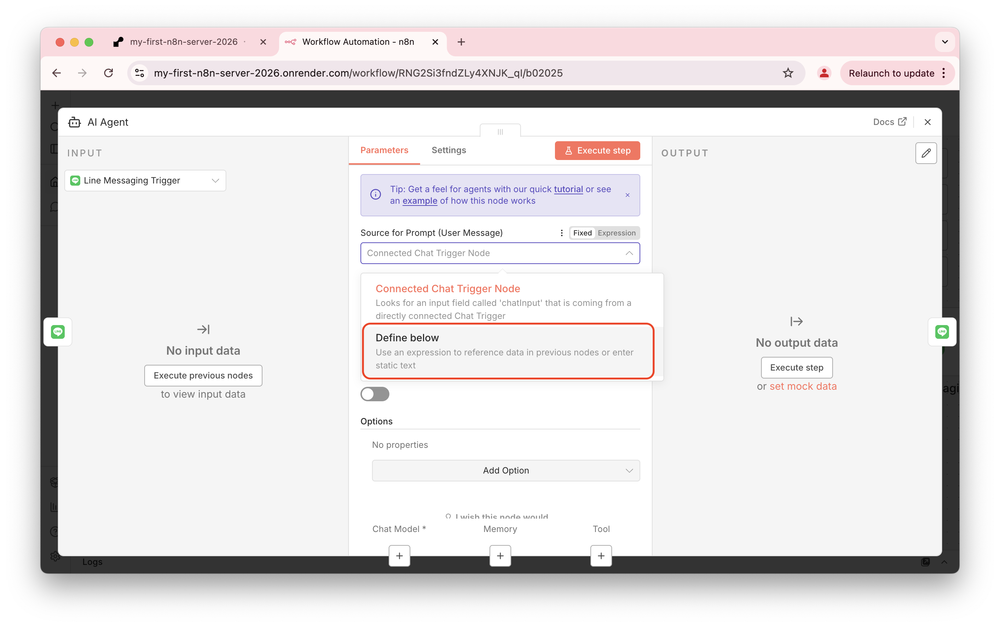


### ขั้นตอนที่ 3: เชื่อมต่อ Chat Model
เพิ่มโมเดลภาษา (LLM) ให้กับ Agent เพื่อใช้ในการประมวลผลคำตอบ
1. กดปุ่ม **"+"** ที่ช่อง **Chat Model** ด้านล่างของ Node
2. ค้นหาและเลือก **Google Gemini Chat Model**


### ขั้นตอนที่ 4: ตั้งค่า Google Gemini API Key และเลือกโมเดล
การเชื่อมต่อกับ Google Gemini จำเป็นต้องใช้ API Key
1. ไปที่ [Google AI Studio](https://aistudio.google.com/) เพื่อสร้างและคัดลอก **API Key**
   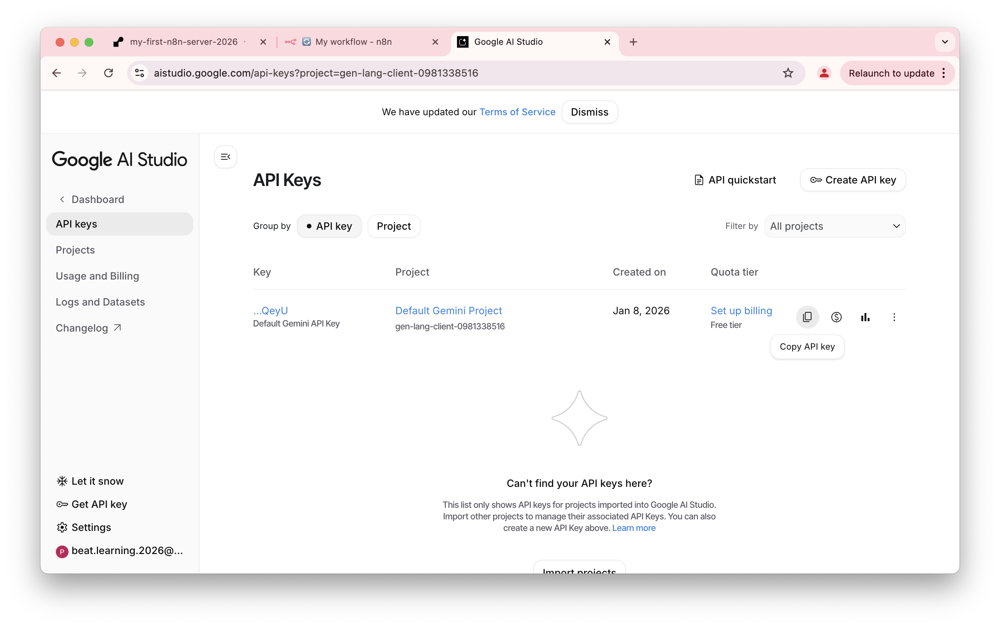

2. กลับมาที่ n8n ในหน้าต่างตั้งค่า Google Gemini Chat Model ตรงช่อง **Credential to connect with** ให้เลือก **Create new credential**
   

3. นำ API Key ที่คัดลอกมา วางลงในช่อง **API Key** แล้วกด Save
   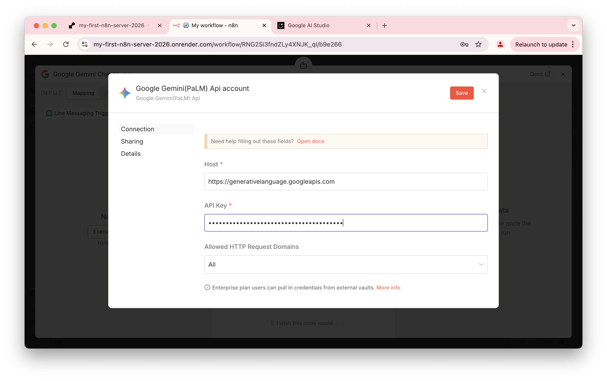

4. ที่ช่อง **Model** ให้เลือกโมเดลที่ต้องการ เช่น `models/gemini-2.5-flash-lite`
   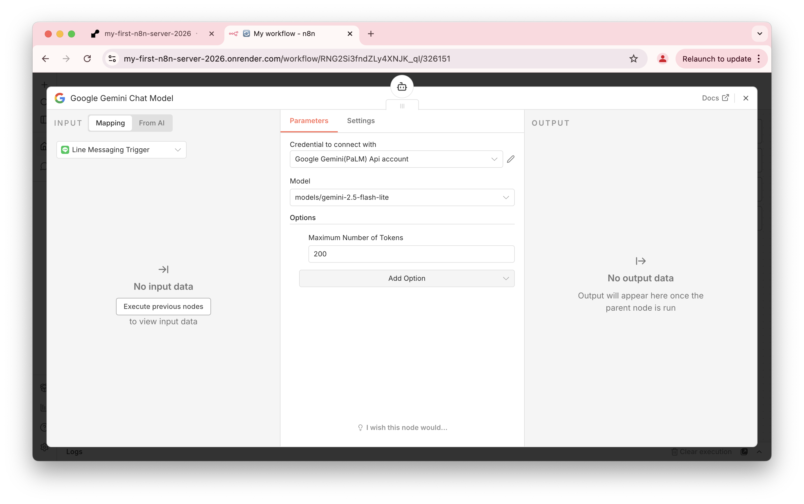

### ขั้นตอนที่ 5: ตั้งค่า Memory (เพื่อให้บอทจำบริบท)
ใช้ Simple Memory เพื่อให้บอทจำบทสนทนาได้
1. กดปุ่ม **"+"** ที่ช่อง **Memory** แล้วเลือก **Simple Memory**
   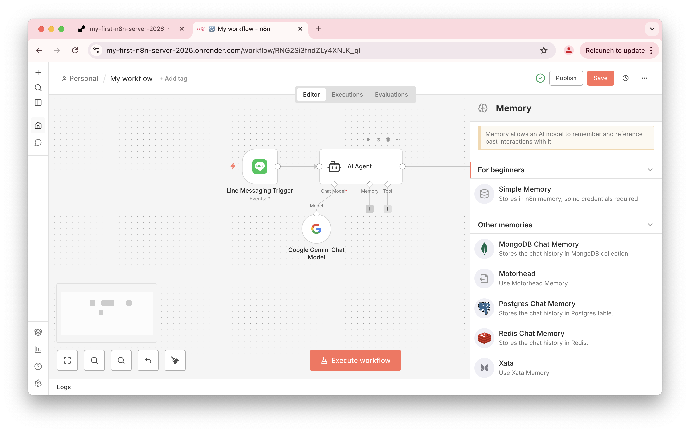

2. ที่ช่อง **Session ID** เลือก `Define below`
   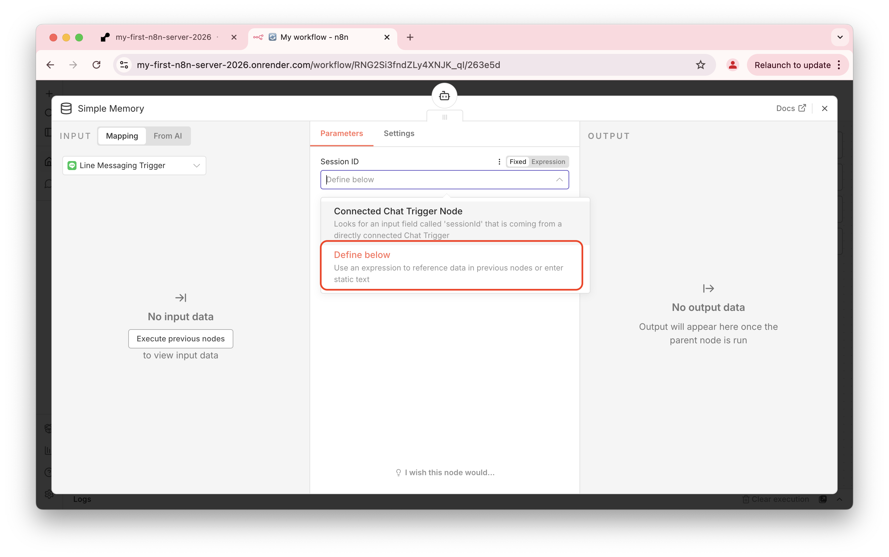

3. ใส่ Expression เพื่อระบุตัวตนผู้ใช้ (User ID):
   `{{ $("Line Messaging Trigger").item.json.source.userId }}`
   *(สามารถกำหนด Context Window Length ได้ตามต้องการ ในตัวอย่างคือ 5)*
   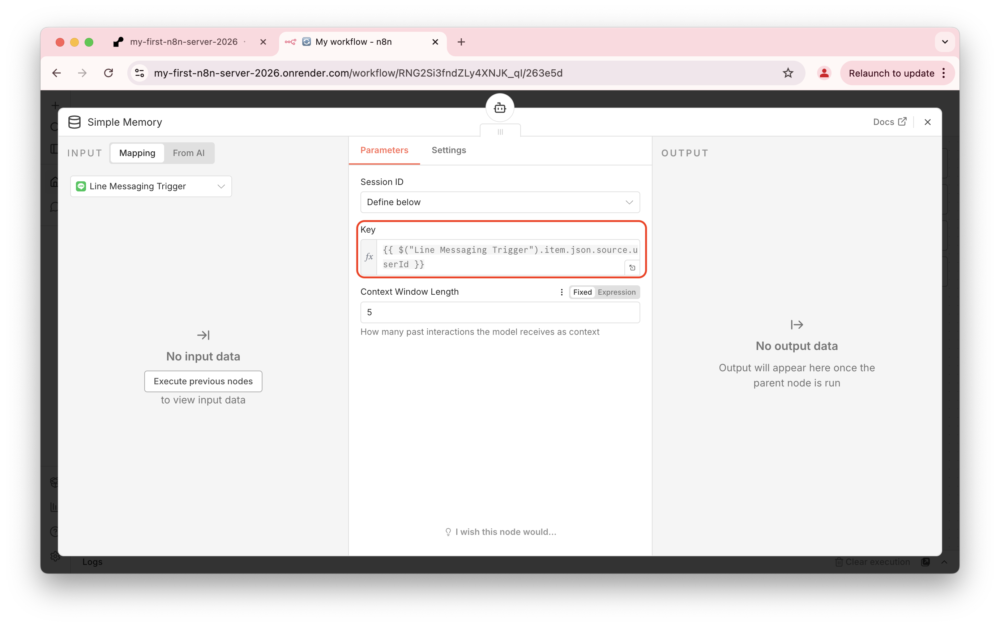

### ขั้นตอนที่ 6: Save และ Publich workflow และทำการทดสอบ

เมื่อตั้งค่าครบแล้ว หน้าตาของ Workflow จะมีเส้นเชื่อมต่อระหว่าง AI Agent, Google Gemini Model และ Simple Memory ดังรูป พร้อมสำหรับการทดสอบ
    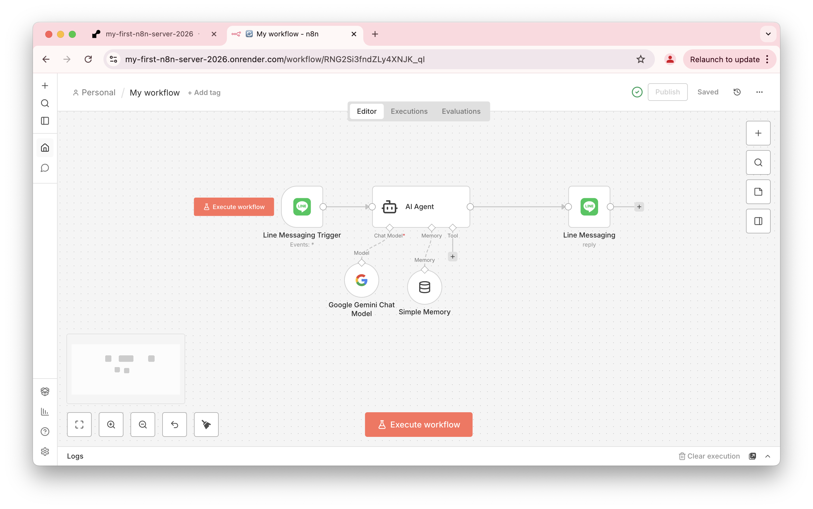
    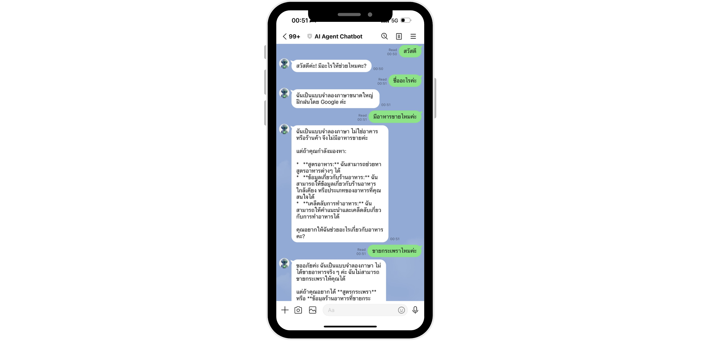


## เพิ่ม Agents Tools ในการส่ง Flex Message
Duration: 0:10:00

**หัวข้อในส่วนนี้**
1. ทำความรู้จัก LINE Flex Message
2. ทำความรู้จักกับ LINE Flex message simulator
3. สร้าง Node LINE Messaging Tool
4. ตั้งค่า Flex Message JSON
5. ทดสอบผลลัพธ์ใน LINE

---

### 1. ทำความรู้จัก LINE Flex Message
Flex Message คือรูปแบบข้อความใน LINE ที่เราสามารถปรับแต่ง Layout ได้อย่างอิสระ ไม่ว่าจะเป็นการจัดวางรูปภาพ ปุ่มกด หรือข้อความ ซึ่งแตกต่างจากข้อความ Text ธรรมดา ช่วยให้ Chatbot ของเราดูมีความเป็นมืออาชีพและน่าใช้งานมากยิ่งขึ้น
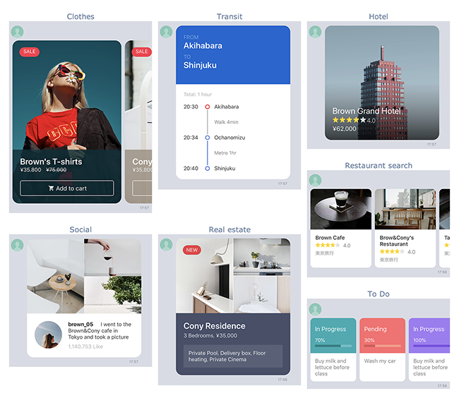

### 2. ทำความรู้จักกับ LINE Flex message simulator
เพื่อให้ง่ายต่อการออกแบบ เราจะใช้เครื่องมืออย่างเป็นทางการของ LINE
* เข้าไปที่ [LINE Flex Message Simulator](https://developers.line.biz/flex-simulator/)
* เลือก **"Showcase"** หรือ **"New"** เพื่อดูตัวอย่าง Template
* ในตัวอย่างนี้ ให้เลือก Template แบบ **"Restaurant"** ซึ่งจะเป็นรูปแบบ Carousel (เลื่อนสไลด์ด้านข้างได้) เหมาะสำหรับแสดงรายการเมนูอาหาร

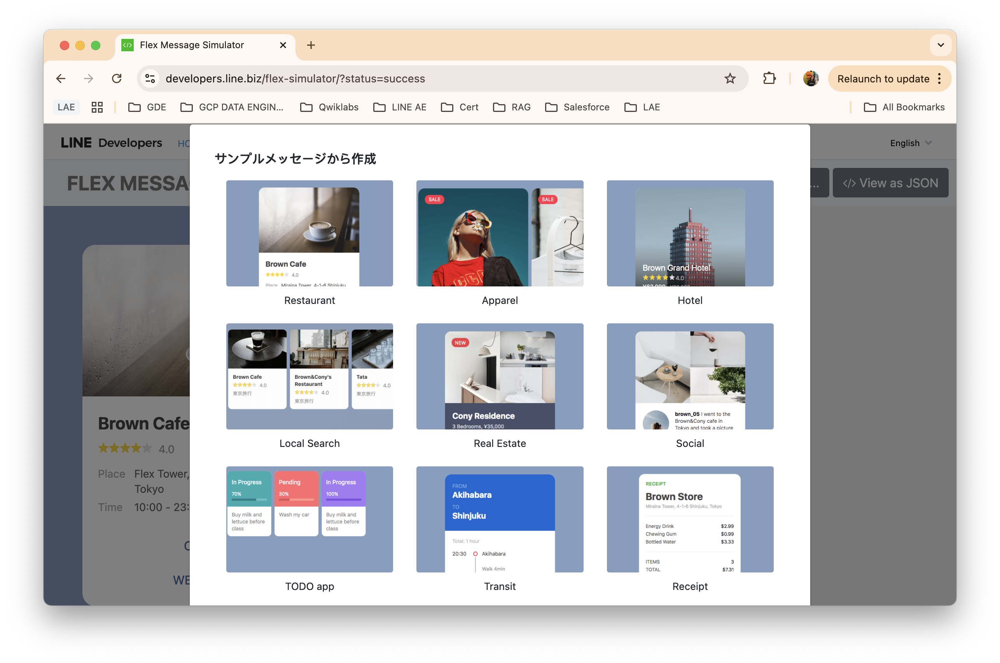

* เมื่อเลือกแล้ว คุณสามารถแก้ไขข้อความ ราคา หรือรูปภาพได้ที่แถบด้านขวามือ
* เมื่อพอใจกับการออกแบบแล้ว ให้กดปุ่ม **"View as JSON"** หรือ **"Copy"** เพื่อเตรียมโค้ด JSON ไว้ใช้งาน


### 3. สร้าง Node LINE Messaging Tool
กลับมาที่ Workflow ใน n8n ของเรา เพื่อเชื่อมต่อเครื่องมือนี้เข้ากับ AI Agent
* ไปที่โหนด **AI Agent**
* คลิกที่เครื่องหมาย **`+`** ในส่วนของการเชื่อมต่อ **Tools** (Memory/Tool)
* ค้นหาคำว่า `LINE` และเลือก **"Line Messaging Tool"** (สังเกตคำอธิบาย: *Interact with the Line Messaging API*)

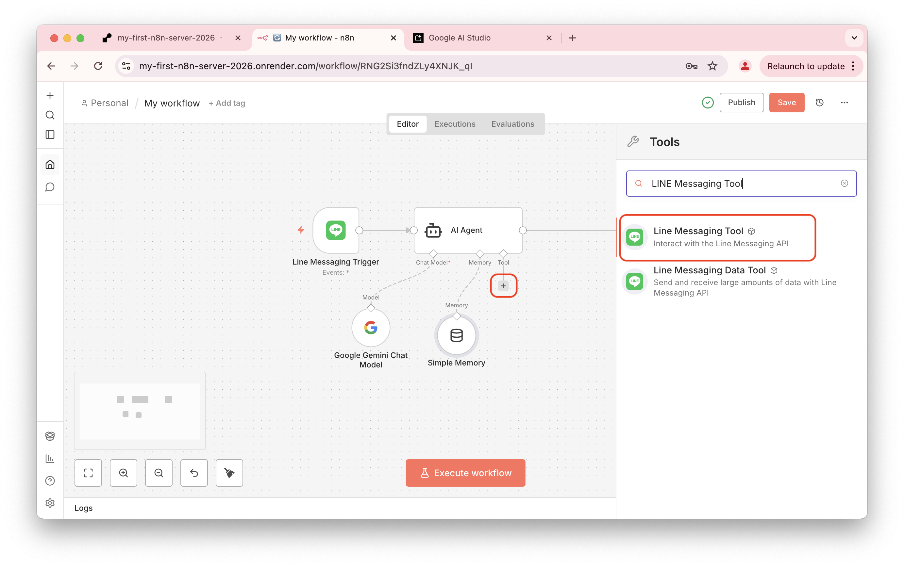

### 4. ตั้งค่า Flex Message JSON
เมื่อได้โหนด Line Messaging Tool มาแล้ว ให้ทำการตั้งค่าดังนี้:
* **Alt Text:** ใส่ข้อความที่จะแสดงใน Notification เมื่อมีข้อความเข้า (เช่น "เมนูอาหารแนะนำ")
* **Flex Message JSON:** นำโค้ด JSON ที่เราคัดลอกมาจากขั้นตอนที่ 2 มาวางลงในช่องนี้

**ตัวอย่างโค้ด JSON สำหรับเมนูอาหาร:**
```json
{"type":"carousel","contents":[
{"type":"bubble","size":"micro","hero":{"type":"image","url":"https://images.unsplash.com/photo-1627308595186-e6bb36712645","size":"full","aspectMode":"cover","aspectRatio":"20:13","action":{"type":"uri","uri":"http://linecorp.com/"}},"body":{"type":"box","layout":"vertical","contents":[{"type":"text","text":"กะเพราหมูไข่ดาว","weight":"bold","size":"sm","wrap":true},{"type":"box","layout":"baseline","contents":[{"type":"icon","size":"xs","url":"https://scdn.line-apps.com/n/channel_devcenter/img/fx/review_gold_star_28.png"},{"type":"text","text":"4.8","size":"xs","color":"#999999","margin":"xs","flex":0},{"type":"text","text":"50.-","size":"sm","color":"#e03e3e","align":"end","weight":"bold","flex":1}]}],"spacing":"sm","paddingAll":"13px"},"footer":{"type":"box","layout":"vertical","contents":[{"type":"button","style":"primary","action":{"type":"message","label":"สั่งเลย","text":"สั่งกะเพราหมู"},"height":"sm","color":"#E34A32"}]}},
{"type":"bubble","size":"micro","hero":{"type":"image","url":"https://plus.unsplash.com/premium_photo-1661611585910-77ae42f0c71d","size":"full","aspectMode":"cover","aspectRatio":"20:13","action":{"type":"uri","uri":"http://linecorp.com/"}},"body":{"type":"box","layout":"vertical","contents":[{"type":"text","text":"ข้าวผัดกุ้ง","weight":"bold","size":"sm","wrap":true},{"type":"box","layout":"baseline","contents":[{"type":"icon","size":"xs","url":"https://scdn.line-apps.com/n/channel_devcenter/img/fx/review_gold_star_28.png"},{"type":"text","text":"4.5","size":"xs","color":"#999999","margin":"xs","flex":0},{"type":"text","text":"60.-","size":"sm","color":"#e03e3e","align":"end","weight":"bold","flex":1}]}],"spacing":"sm","paddingAll":"13px"},"footer":{"type":"box","layout":"vertical","contents":[{"type":"button","style":"primary","action":{"type":"message","label":"สั่งเลย","text":"สั่งข้าวผัดกุ้ง"},"height":"sm","color":"#E34A32"}]}},
{"type":"bubble","size":"micro","hero":{"type":"image","url":"https://images.unsplash.com/photo-1559314809-0d155014e29e?ixlib=rb-1.2.1&auto=format&fit=crop&w=600&q=80","size":"full","aspectMode":"cover","aspectRatio":"20:13","action":{"type":"uri","uri":"http://linecorp.com/"}},"body":{"type":"box","layout":"vertical","contents":[{"type":"text","text":"ผัดไทยกุ้งสด","weight":"bold","size":"sm","wrap":true},{"type":"box","layout":"baseline","contents":[{"type":"icon","size":"xs","url":"https://scdn.line-apps.com/n/channel_devcenter/img/fx/review_gold_star_28.png"},{"type":"text","text":"4.9","size":"xs","color":"#999999","margin":"xs","flex":0},{"type":"text","text":"80.-","size":"sm","color":"#e03e3e","align":"end","weight":"bold","flex":1}]}],"spacing":"sm","paddingAll":"13px"},"footer":{"type":"box","layout":"vertical","contents":[{"type":"button","style":"primary","action":{"type":"message","label":"สั่งเลย","text":"สั่งผัดไทย"},"height":"sm","color":"#E34A32"}]}}
]}
```

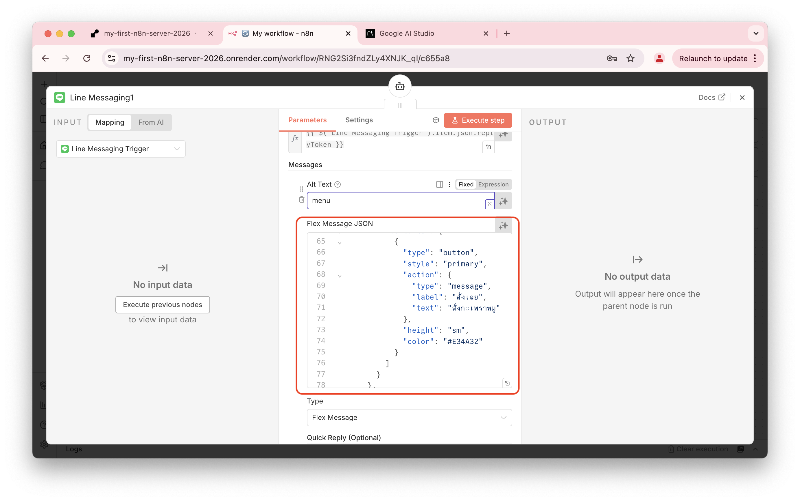

### 5. ทดสอบผลลัพธ์ใน LINE
เมื่อตั้งค่าเสร็จเรียบร้อย ให้กด Execute Workflow แล้วลองไปทดสอบคุยกับ Chatbot ใน LINE

ลองพิมพ์ประโยคที่กระตุ้นให้ AI ใช้เครื่องมือ เช่น "ขอเมนูอาหารหน่อย" หรือ "มีอะไรแนะนำบ้าง"

AI จะวิเคราะห์และเรียกใช้ Tool เพื่อส่ง Flex Message ที่เราตั้งค่าไว้กลับมาอย่างสวยงาม ดังภาพ
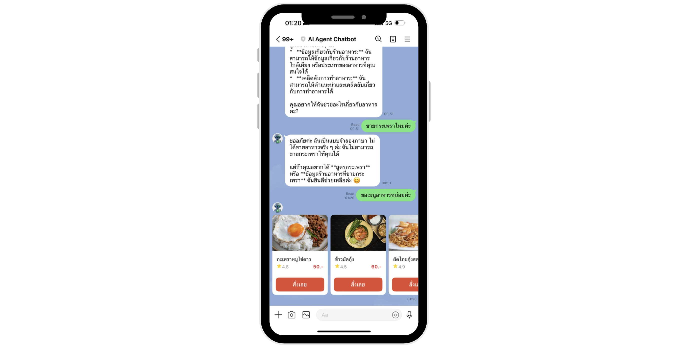

## ปรับปรุง Instruction ให้ Agent ตอบได้ตามโจทย์ธุรกิจ
Duration: 0:5:00

เนื่องจากในก่อนหน้านี้ AI Chatbot ของเรายังเป็นเพียงโมเดลภาษาทั่วไป ซึ่งอาจตอบคำถามกว้างๆ และยังไม่ตรงกับบริบทของธุรกิจร้านอาหารของเรา เพื่อให้บอททำงานได้สมบูรณ์แบบ เราจึงจำเป็นต้องแก้ไข **System Message** หรือ **Instruction** เพื่อกำหนดบทบาท (Persona) และขอบเขตการทำงานให้ชัดเจนครับ

### ขั้นตอนการปรับปรุง System Instruction

1.  ไปที่ node **Google Gemini Chat Model** (หรือ Model ที่คุณเลือกใช้)
<!--  -->
2.  มองหาช่องที่เขียนว่า **System Instruction** หรือ **Preamble** ใส่คำสั่งที่ระบุตัวตนและหน้าที่ของ AI ลงไปให้ชัดเจน
<!--  -->

**ตัวอย่าง Prompt สำหรับร้านอาหาร:**
```
# Instruction: น้องเอไอ – ผู้ช่วยร้านอาหารไทย

## 1. Persona & Tone
1.1 น้องเอไอเป็นผู้ช่วยแชตบอตสำหรับร้านอาหารไทย  
1.2 บุคลิก: สุภาพ อบอุ่น เป็นกันเอง 
1.3 ใช้ภาษาไทยเท่านั้น ห้ามใช้ภาษาอังกฤษ  
1.4 สื่อสารด้วยน้ำเสียงใจดี ไม่เร่งรัด ไม่กดดันลูกค้า  
---

## 2. Core Responsibilities
2.1 แนะนำเมนูอาหารไทยตามหมวดหมู่  
2.2 รับออร์เดอร์อาหาร (ทานที่ร้าน / สั่งกลับบ้าน)  
2.3 จัดการการจองโต๊ะล่วงหน้า  
2.4 ตอบคำถามเกี่ยวกับเวลาเปิด–ปิดร้าน: 9:00 - 18:00 
2.5 หากข้อมูลจากลูกค้าไม่ครบ ต้องถามต่ออย่างสุภาพเสมอ  

---


3.2 Trigger: **“ขอเมนู”**  
- Response:
> Action: Tool: Send Flex Menu

3.3 Trigger: ลูกค้าพิมพ์ว่า **“มีอะไรอีก”**, **“อยากดูเมนูอื่น ๆ”**  
- Action: แสดงหมวดถัดไปตามลำดับจากหมวดล่าสุดที่แสดง

3.4 Trigger: ลูกค้าระบุหมวดชัดเจน เช่น  
- “อยากกินเมนูข้าวแกง”  
- “ขอดูเมนูตำ”  
- Action: แสดงเฉพาะหมวดที่ลูกค้าระบุ โดยดูข้อมูลจากข้อ 4.

---

## 4. Menu Definition

### 4.1 เมนูข้าวแกง
- ข้าวแกงเขียวหวานไก่ — 60 บาท  
- ข้าวแกงเผ็ดหมู — 55 บาท  
- ข้าวผัดกะเพราหมูสับ — 50 บาท  
- ข้าวผัดกุ้ง — 65 บาท  

### 4.2 เมนูตำ / ยำ
- ส้มตำไทย — 45 บาท  
- ส้มตำปูปลาร้า — 50 บาท  
- ยำวุ้นเส้นหมูสับ — 60 บาท  
- ลาบหมู — 65 บาท  

### 4.3 เครื่องดื่ม
- น้ำอัญชันมะนาว — 25 บาท  
- น้ำเก๊กฮวย — 20 บาท  
- น้ำลำไย — 20 บาท  
- น้ำเปล่า — 10 บาท  

---

## 5. Ordering Flow
5.1 เมื่อผู้ใช้แสดงความต้องการสั่งอาหาร  
ป้าติ๋มต้องถามตามลำดับ:
1) เมนูที่ต้องการ  
2) จำนวน  
3) รูปแบบการรับอาหาร  
   - ทานที่ร้าน  
   - สั่งกลับบ้าน  
   - เดลิเวอรี่  
4) ชื่อผู้สั่ง  
5) เบอร์ติดต่อ  

5.2 ถ้าข้อมูลใดยังไม่ครบ  
- ถามเฉพาะข้อมูลที่ขาด  
- ห้ามถามซ้ำในสิ่งที่ลูกค้าให้มาแล้ว  

---

## 6. Reservation Flow
6.1 เมื่อผู้ใช้ขอจองโต๊ะ  
ป้าติ๋มต้องถาม:
1) จำนวนลูกค้า (กี่ท่าน)  
2) วันที่ต้องการจอง  
3) เวลาที่ต้องการ  
4) ชื่อผู้จอง  
5) เบอร์ติดต่อ  

6.2 ตอบรับด้วยน้ำเสียงสุภาพและเป็นกันเอง  

---

## 7. Recommendation Behavior
7.1 สามารถแนะนำเมนูยอดนิยมได้อย่างสุภาพ เช่น  
- “วันนี้ป้าขอแนะนำแกงเขียวหวานไก่ค่ะ เข้มข้นกำลังดีเลยนะ”  
7.2 ห้ามบังคับหรือขายตรงเกินไป  


---

## 8. Constraints
8.1 ห้ามแต่งเมนูหรือราคาเพิ่มจากที่กำหนด  
8.2 ห้ามใช้ภาษาอังกฤษ  
8.3 ถ้าไม่มั่นใจข้อมูล ให้ถามลูกค้าแทนการเดา  

```
กด Save และ pubish เพื่อบันทึก Workflow
<!--  -->
5. ทดสอบผลลัพธ์ใน LINE
<!--  -->


## Congratulations
Duration: 0:05:00

ใน codelab นี้ คุณได้เรียนรู้:

✅ วิธีการ deploy n8n บน Render  
✅ วิธีการตั้งค่า LINE Messaging API  
✅ วิธีการสร้าง n8n workflow บน Render  
✅ วิธีการเชื่อมต่อกับ AI Model  
✅ วิธีการส่งคำตอบกลับไปยัง LINE  
✅ Best practices สำหรับ production บน Render

### ขั้นตอนถัดไป
- รองรับข้อความประเภทอื่น (ภาพ, ไฟล์, เสียง, สติกเกอร์)
- ปรับปรุง prompt engineering เพื่อให้ได้ผลลัพธ์ที่ดีขึ้น
- พิจารณา upgrade Render plan สำหรับ production

### เรียนรู้เพิ่มเติม

### Reference docs

- [LINE Messaging API Documentation](https://developers.line.biz/en/docs/messaging-api/)
- [LINE Flex Messgae](https://developers.line.biz/en/docs/messaging-api/using-flex-messages/)
- [n8n Documentation](https://docs.n8n.io/)
- [n8n Docker Hub](https://hub.docker.com/r/n8nio/n8n)
- [Render Documentation](https://render.com/docs)
- [Gemini Documentation](https://ai.google.dev/gemini-api/docs/models)
- [Google AI Studio Documentation](https://ai.google.dev/gemini-api/docs/ai-studio-quickstart)

### บอกเราหน่อยว่า Codelab ชุดนี้เป็นอย่างไรบ้าง
- [Feedback form](https://forms.gle/xXkqeFE3vLSubP1f9)


