id: n8n-line-ai-agent
title: Build a Smart LINE AI Chatbot Without Coding Using n8n
summary: สร้าง AI Chatbot สำหรับ LINE โดยไม่ต้องเขียนโค้ด โดยใช้ n8n self-hosted บน Render
authors: Punsiri Boonyakiat
categories: 
  - LINE Messaging API
tags: 
  - LINE Messaging API
  - n8n
  - AI Chatbot
status: Published


# Build a Smart LINE AI Chatbot Without Coding Using n8n


## บทนำ
Duration: 0:05:00


ในยุคที่ AI เข้ามามีบทบาทสำคัญ การสร้าง Chatbot ที่ "ฉลาด" และ "เข้าใจบริบท" ไม่จำเป็นต้องเขียนโค้ดที่ซับซ้อนอีกต่อไป

ใน Codelab นี้ คุณจะได้สร้าง LINE AI Chatbot ที่ทำงานบน n8n (Workflow Automation Tool) ซึ่งติดตั้งบน Render (Cloud Hosting) และใช้สมองของ Google Gemini ในการประมวลผลคำตอบ ทั้งหมดนี้ด้วยวิธี Low-Code


### สิ่งที่คุณจะได้ลงมือทำ
- Deploy n8n ขึ้นบน Cloud (Render) ฟรี
- เชื่อมต่อ LINE Official Account เข้ากับ n8n
- สร้าง Workflow รับส่งข้อความอัตโนมัติ
- เชื่อมต่อ Google Gemini เพื่อให้บอทตอบคำถามได้อย่างเป็นธรรมชาติ

### สิ่งที่คุณจะได้เรียนรู้

- **เข้าใจระบบ**: เรียนรู้หลักการทำงานของ LINE Messaging API และ AI Automation

- **เตรียมความพร้อม**: สร้าง LINE OA และตั้งค่า Messaging API ให้พร้อมใช้งาน

- **ติดตั้งเครื่องมือ**: รู้จัก n8n และวิธี Deploy แบบ Self-hosted บน Render

- **เชื่อมต่อ**: สร้าง Webhook ด้วย n8n เพื่อรับ-ส่งข้อความกับผู้ใช้

- **สร้างบอท**: พัฒนา AI Chatbot ตัวแรกบน LINE ที่ใช้งานได้จริง

- **ปรับแต่ง AI**: เทคนิคการเขียนคำสั่ง (Prompt) ให้ AI เข้าใจบริบทและตอบโจทย์ธุรกิจ

- **ประกอบร่าง**: สร้าง Workflow อัตโนมัติที่สมบูรณ์ (รับข้อความ → คิดด้วย AI → ตอบกลับ)  

### สิ่งที่คุณต้องเตรียมพร้อมก่อนเริ่ม Codelab 

- **แอปพลิเคชัน LINE บนสมาร์ทโฟน** ที่เข้าสู่ระบบเรียบร้อยแล้ว – สำหรับใช้สร้างและจัดการ LINE Official Account

- **บัญชี Google (Gmail)** – สำหรับเข้าใช้งาน Google AI Studio เพื่อกดรับ Gemini API Key

- **บัญชี Render (สมัครฟรี)** – สำหรับใช้เป็น Server ในการ Deploy และรัน n8n


## ทำความรู้จักกับ LINE Messaging API
Duration: 0:10:00

### LINE Messaging API คืออะไร

**LINE Messaging API** เป็น API ที่ให้บริการโดย LINE Corporation เพื่อให้ผู้พัฒนาสามารถสร้างแอปพลิเคชันที่สามารถรับและส่งข้อความผ่าน LINE Platform ได้

#### ฟีเจอร์หลัก

- **รับข้อความจากผู้ใช้**: รับข้อความ text, image, sticker, location, file
- **ส่งข้อความกลับ**: ส่งข้อความ text, image, video, audio, location, sticker
- **Rich Messages**: Flex Messages, Carousel, Quick Reply, Buttons


#### องค์ประกอบหลัก

1. **LINE Platform**
   - จัดการการรับส่งข้อความ
   - ส่ง Webhook events เมื่อมีข้อความใหม่
   - รับ API requests เพื่อส่งข้อความกลับ

2. **Webhook Server (n8n)**
   - รับ Webhook events จาก LINE
   - ประมวลผลข้อความ
   - ส่งคำตอบกลับผ่าน LINE Messaging API

3. **AI/LLM Service (Gemini)**
   - ประมวลผลข้อความด้วย AI
   - สร้างคำตอบที่เหมาะสม
   - จัดการ context และ memory


## สร้าง LINE OA และเปิดใช้งาน Messaging API
Duration: 0:15:00

### สร้าง LINE Official Account

จุดเริ่มต้นของการพัฒนา LINE Chatbot คือคุณจะต้องสร้าง LINE OA(LINE Official Account) และเปิดใช้งาน Messaging API

1. เข้าไปที่ [https://manager.line.biz](https://manager.line.biz) แล้วเลือก **Log in with LINE account** (สีเขียว) เพื่อเข้าสู่ระบบ

2. เข้าสู่ระบบด้วยบัญชี LINE ของคุณให้เรียบร้อย

3. กดสร้าง LINE OA จากปุ่ม **Create LINE official account** สำหรับผู้ที่สร้าง LINE OA ครั้งแรก หรือกด **Create new** ทางด้านซ้ายสำหรับผู้ที่เคยสร้าง LINE OA แล้ว

4. ให้ระบุข้อมูลต่างๆ ลงไปในฟอร์ม แล้วกด **ตกลง**

5. จากนั้นให้ยืนยันรายละเอียดในการสร้าง LINE OA เป็นอันเสร็จสิ้น

### เปิดใช้งาน Messaging API

หลังจากที่เรามี LINE OA เรียบร้อยแล้ว ขั้นตอนนี้จะพาทุกคนไปเพิ่มความสามารถให้ LINE OA ของเรากลายเป็น LINE Chatbot ได้

1. เข้าไปที่ [https://manager.line.biz](https://manager.line.biz) ในกรณีที่เรามีบัญชี LINE OA ที่สร้างไว้แล้ว หน้านี้จะแสดงบัญชี LINE OA ต่างๆ ที่เรามี ก็ให้เรากดเลือกบัญชี LINE OA ที่เราต้องการ

2. ให้เราไปที่เมนู **Settings > Messaging API** แล้วให้กดปุ่ม **Enable Messaging API**

3. หากเป็นการ Enable Messaging API ครั้งแรกของบัญชี LINE Business ID จะเจอหน้าให้ลงทะเบียน Developer info ก็ให้กรอก **ชื่อ** และ **อีเมล**

4. จากนั้นให้สร้าง Provider ใหม่ หรือเลือก Provider เดิมกรณีที่เคยสร้างไปแล้ว

<aside class="positive">
<strong>Note:</strong> Provider คือชื่อผู้ให้บริการ ซึ่งจะไปแสดงตามหน้า consent ต่างๆ ซึ่งถือเป็น superset ของ chatbot ทั้งหลายที่เราจะพัฒนาขึ้นรวมถึง LIFF app โดยเราสามารถระบุชื่อของ Provider เป็น ชื่อตัวเอง, ชื่อบริษัท, ชื่อทีม หรือชื่อกลุ่มก็ได้
</aside>

<aside class="negative">
<strong>Remember:</strong> 1 Account สามารถมี Provider สูงสุดได้ 10 Providers และไม่สามารถมีคำว่า LINE ในชื่อ Provider ได้
</aside>

5. ระบุ URL ของ **Privacy Policy** และ **Terms of Use** (ถ้ามี) หากยังไม่มีก็สามารถกดปุ่ม **ok** ข้ามไปได้

6. ยืนยันการเปิดใช้งาน Messaging API ด้วยการกด **Ok**

7. เมื่อเจอหน้านี้ ก็แปลว่าคุณได้เปิดใช้งาน Messaging API ให้กับบัญชี LINE OA เรียบร้อยแล้ว

### เพิ่ม Chatbot เป็นเพื่อนและตั้งค่า Channel

ขั้นตอนนี้เราจะเข้าไปใช้งาน LINE Developers Console ซึ่งเป็นเว็บไซต์สำหรับการบริหารจัดการ LINE Chatbot(LINE OA ที่เปิดใช้งาน Messaging API แล้ว) ในส่วนของนักพัฒนา

1. เข้าไปที่ [https://developers.line.biz/console/](https://developers.line.biz/console/)
   ให้กดเลือก **Provider** ที่ต้องการ

2. เราจะพบกับบัญชี LINE OA ที่เราได้เปิดใช้งาน Messaging API ไว้ ซึ่งในที่นี้เราจะเรียกมันว่า **Channel** (Channel จะเปรียบเสมือน Chatbot หรือ App) ก็ให้กดเลือก **Channel** ที่ต้องการ

3. ให้ไปที่ Tab ชื่อ **Messaging API** และทำการแสกน **QR code** ด้วยแอป LINE เพื่อเพิ่ม Chatbot เป็นเพื่อน

4. ให้ปิด **Auto-reply messages** เนื่องจากฟีเจอร์นี้จะเป็น default การตอบกลับของ Chatbot ซึ่งไม่จำเป็นต้องใช้ฟีเจอร์นี้

5. กลับมาที่ Channel ที่เราสร้างใน Tab ชื่อ **Messaging API** ตรงส่วนของ **Channel access token** ให้กดปุ่ม **Issue**
<aside class="negative">
<strong>Important:</strong> ตัว Channel Access Token คือกุญแจสำคัญในการใช้งาน Messaging API ดังนั้นให้เก็บรักษาไว้ให้ดี
</aside>


## ทำความรู้จักกับ n8n
Duration: 0:10:00

### n8n คืออะไร และเหมาะกับงานแบบไหน

**n8n** (pronounced "n-eight-n") เป็น open-source workflow automation tool ที่ช่วยให้คุณสามารถเชื่อมต่อ services และ APIs ต่างๆ เข้าด้วยกันได้โดยไม่ต้องเขียนโค้ดมาก

#### ฟีเจอร์หลัก

- **Visual Workflow Editor**: สร้าง workflow ด้วยการ drag-and-drop
- **400+ Integrations**: เชื่อมต่อกับ services มากมาย (Google, Slack, GitHub, Database, APIs)
- **Self-hosted**: สามารถ host เองได้ (ฟรี) หรือใช้ n8n Cloud (paid)
- **Extensible**: เขียน custom nodes ได้ด้วย JavaScript/TypeScript
- **Workflow Templates**: มี templates สำเร็จรูปให้ใช้

#### เหมาะกับงานแบบไหน?

1. **Automation Tasks**
   - จัดการข้อมูลระหว่าง services
   - สร้าง reports อัตโนมัติ
   - Sync ข้อมูลระหว่าง systems

2. **API Integration**
   - เชื่อมต่อ APIs หลายตัวเข้าด้วยกัน
   - Transform และ enrich ข้อมูล
   - สร้าง API endpoints ใหม่

3. **Chatbots & AI Agents**
   - สร้าง chatbot สำหรับ messaging platforms
   - เชื่อมต่อกับ AI/LLM services
   - จัดการ conversation flow

4. **Data Processing**
   - Process และ transform ข้อมูล
   - ส่งข้อมูลไปยัง database
   - สร้าง data pipelines

5. **Notifications & Alerts**
   - ส่งการแจ้งเตือนเมื่อมี event เกิดขึ้น
   - สร้าง monitoring workflows
   - Integrate กับ notification services


### แนวคิด Workflow-based Automation

#### Workflow คืออะไร?

**Workflow** คือลำดับของ steps (nodes) ที่ทำงานต่อเนื่องกัน โดยแต่ละ node จะ:
- รับข้อมูลจาก node ก่อนหน้า
- ประมวลผลข้อมูล
- ส่งข้อมูลไปยัง node ถัดไป

### ตัวอย่าง Workflow

```text
Webhook (รับข้อความ)
   ↓
IF (ตรวจสอบประเภทข้อความ)
   ↓ (True)
Set (เตรียมข้อมูล)
   ↓
AI Agent (ประมวลผลด้วย AI)
   ↓
HTTP Request (ส่งข้อความกลับ)
```

#### ประเภทของ Nodes

1. **Trigger Nodes**: เริ่ม workflow (Webhook, Schedule, Manual Trigger)
2. **Action Nodes**: ทำ action ต่างๆ (HTTP Request, Database, Email)
3. **Logic Nodes**: ควบคุม flow (IF, Switch, Merge)
4. **Data Nodes**: จัดการข้อมูล (Set, Code, Function)
5. **AI Nodes**: เชื่อมต่อกับ AI services (OpenAI, Anthropic)

### ข้อดีของ Workflow-based

- **Visual**: เห็น flow ทั้งหมดได้ชัดเจน
- **No Code / Low Code**: ไม่ต้องเขียนโค้ดมาก
- **Reusable**: สามารถ reuse workflows และ nodes
- **Debuggable**: ดูข้อมูลในแต่ละ step ได้ง่าย
- **Maintainable**: แก้ไขและปรับปรุงได้ง่าย


**เหมาะกับใคร?**
- **n8n**: เมื่อต้องการ self-hosted และ open source
- **Make**: เมื่อต้องการ visual editor ที่ดีมากและ error handling ที่ยอดเยี่ยม
#### สรุป: ทำไมเลือก n8n?

1. **Self-hosted ฟรี**: ไม่มีค่าใช้จ่ายสำหรับ self-hosted
2. **Open Source**: สามารถปรับแต่งและ extend ได้
3. **Flexibility**: เชื่อมต่อกับ services มากมาย
4. **Control**: ควบคุมข้อมูลและ infrastructure ได้เต็มที่
5. **Cost-effective**: ประหยัดเมื่อเทียบกับ SaaS solutions


## ใช้งาน n8n แบบ Self-host บน Render
Duration: 0:20:00

เราจะ deploy n8n บน Render โดยใช้ Docker image ที่มีอยู่แล้ว ซึ่งเป็นวิธีที่ง่ายและเร็วที่สุด

### ขั้นตอนทั้งหมด

1. เข้าสู่ระบบ Render Dashboard
2. สร้าง Web Service บน Render
3. ตั้งชื่อ Service และเลือก Plan
4. ตั้งค่า Environment Variables และ Deploy Service
5. เริ่มต้นใช้งาน n8n บน Render

---

### ขั้นตอนที่ 1: เข้าสู่ระบบ Render Dashboard

1. ไปที่ [Render Register](https://dashboard.render.com/register)
2. ในหน้าการเข้าสู่ระบบ **Create an account** ให้เลือกเข้าสู่ระบบด้วย Google เพื่อใช้บัญชี Google ของคุณ
   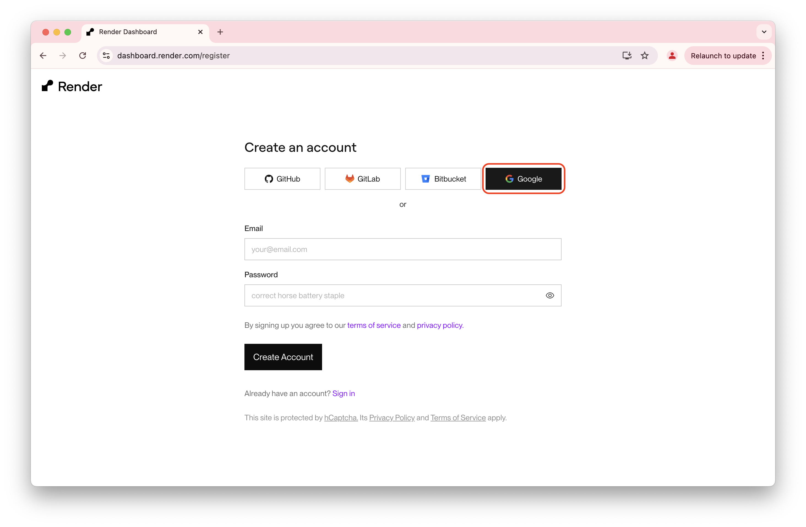
3. เลือกบัญชี Google ที่ต้องการใช้สำหรับเข้าสู่ระบบ
   
4. เมื่อเข้าสู่ระบบสำเร็จ ระบบจะพาคุณไปยังหน้า Render Dashboard
   

### ขั้นตอนที่ 2: สร้าง Web Service บน Render

1. ที่หน้า Render Dashboard ให้ดูที่หัวข้อ **Web Services** แล้วคลิกปุ่ม **"New Web Service"** (หรือคลิก **"New +"** ที่มุมขวาบนแล้วเลือก **Web Service**)
   

2. ในหน้าถัดมา หัวข้อ **Source Code** ทางด้านขวา:
   - เลือกแท็บ **"Existing Image"**
   - ในช่อง **Image URL** ให้พิมพ์หรือวางโค้ด: `n8nio/n8n:latest`
   - คลิกปุ่ม **"Connect"**
   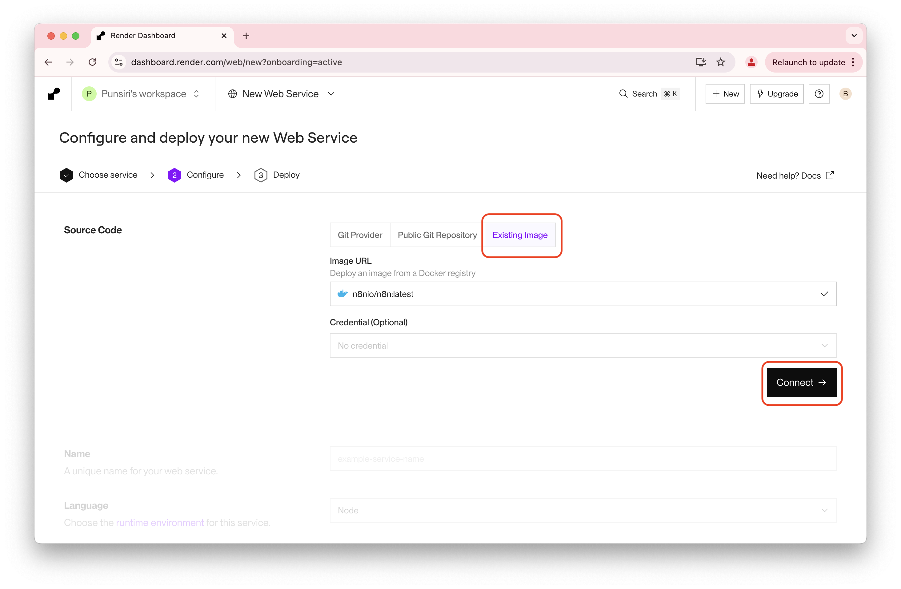

### ขั้นตอนที่ 3: ตั้งชื่อ Service และเลือก Plan

1. **Name**: ตั้งชื่อ Service ของคุณ (เช่น `my-first-n8n-server-2026`)
2. **Region**: เลือกภูมิภาคของเซิร์ฟเวอร์ที่ใกล้ที่สุด (แนะนำ Singapore เพื่อความเร็วในการเชื่อมต่อจากไทย)
3. **Instance Type**:
   - เลือก **Free** สำหรับการทดสอบ

<aside class="negative">
<strong>Important:</strong> Instance Type แบบฟรีจะหยุดทำงานเมื่อไม่มีการใช้งาน และจะทำให้การเรียกใช้งานครั้งแรกล่าช้า 50 วินาทีหรือมากกว่า
</aside>

<aside class="positive">
<strong>Tip:</strong> แนะนำใช้แผน Starter สำหรับ production เพื่อความเสถียรและไม่ sleep
</aside>


### ขั้นตอนที่ 4: ตั้งค่า Environment Variables

1. คลิกที่ปุ่ม **"Advanced"** และเลือก **"Add Environment Variable"**
2. เพิ่ม Environment Variables ตามตารางด้านล่าง:

    | **Key** | **Value** | **Description** |
    | :--- | :--- | :--- |
    | `N8N_PROTOCOL` | `https` | Protocol สำหรับ webhook |
    | `WEBHOOK_URL` | `https://[ชื่อแอปของคุณ].onrender.com/` | Webhook URL สำหรับ n8n เช่น `https://my-first-n8n-server-2026.onrender.com/` |

3. หลังจากนั้นให้กดปุ่ม **"Create Web Service"** (หรือ **Deploy Web Service**)
   

4. รอจนกว่า Deployment จะเสร็จสมบูรณ์ (ประมาณ 2-5 นาที)
   

5. หลังจาก Deploy เสร็จ ให้เปิด URL ด้านบนซ้ายเพื่อเริ่มต้นใช้งาน n8n
   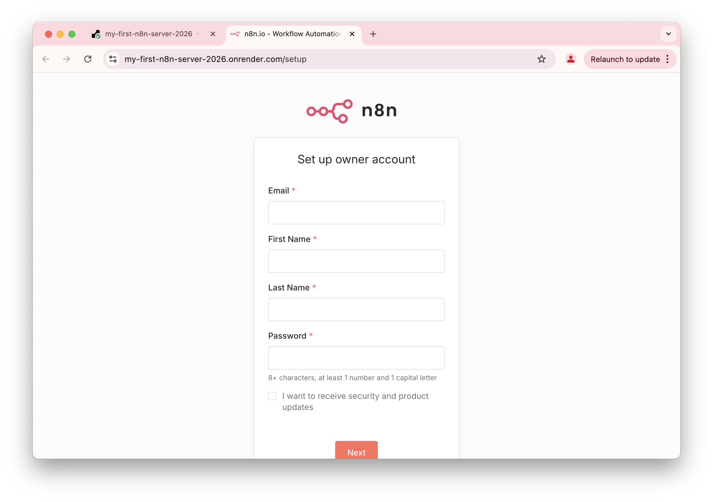

### ขั้นตอนที่ 5: เริ่มต้นใช้งาน n8n บน Render

1. **ตั้งค่าบัญชีผู้ดูแลระบบ (Owner Account)**
   เมื่อเปิด URL ขึ้นมาครั้งแรก จะปรากฏหน้า **Set up owner account** ให้กรอกข้อมูลเพื่อสร้างบัญชี Admin:
   - **Email**: อีเมลของคุณ
   - **First Name / Last Name**: ชื่อและนามสกุล
   - **Password**: ตั้งรหัสผ่าน (ต้องมีอย่างน้อย 8 ตัวอักษร, ตัวเลข, และตัวพิมพ์ใหญ่)
   
   คลิกปุ่ม **"Next"**
   

2. ระบบจะสอบถามข้อมูลการใช้งานเบื้องต้น (เช่น บทบาทของคุณ, ขนาดบริษัท) ให้เลือกคำตอบที่ตรงกับคุณ
   
   คลิกปุ่ม **"Get started"**
   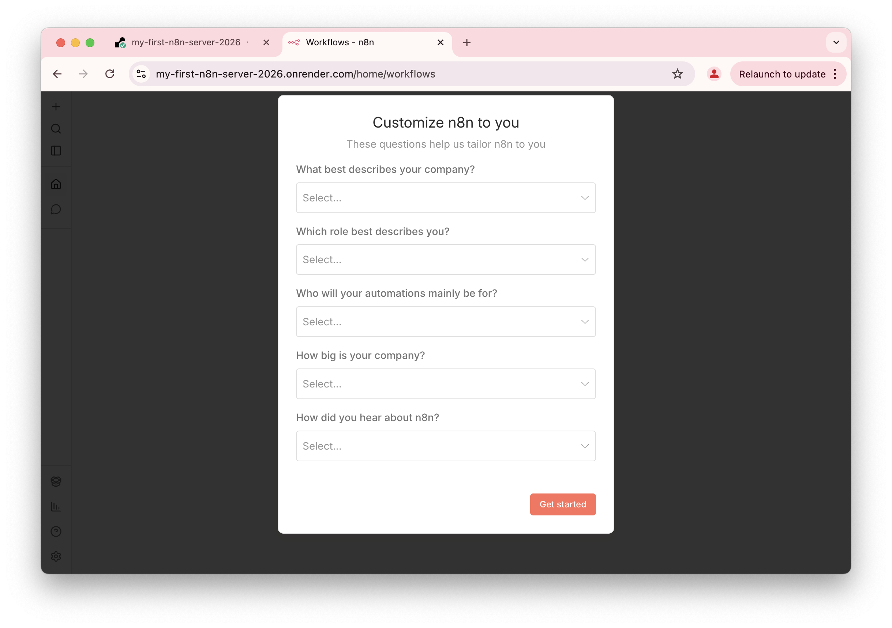

3. เมื่อเข้าสู่หน้า Dashboard หลัก จะพบข้อความต้อนรับ **Welcome [ชื่อของคุณ]!**
   คุณสามารถคลิกที่ **"Start from scratch"** เพื่อเริ่มสร้าง Workflow แรกได้ทันที
   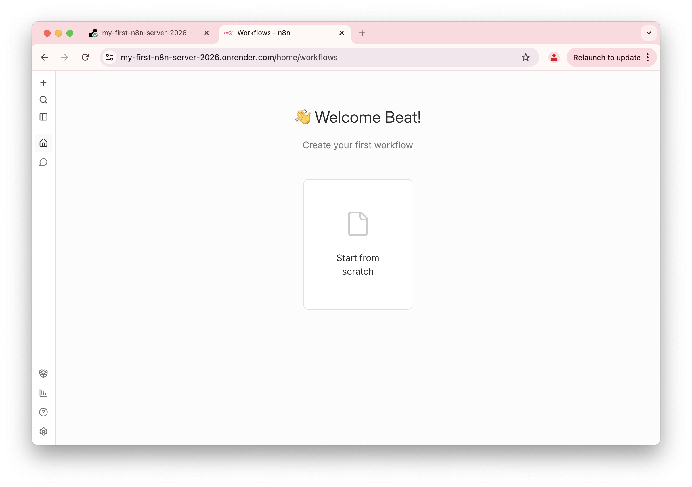

## สร้าง LINE Webhook Node บน n8n และเชื่อมต่อกับ LINE Chatbot
Duration: 0:15:00

เราจะตั้งค่า n8n ให้รับข้อความจาก LINE โดยใช้ Node **"Line Messaging"** (ต้องติดตั้งเพิ่ม) ซึ่งจะจัดการเรื่อง Webhook ให้เราโดยอัตโนมัติ 

### ขั้นตอนทั้งหมด
1. สร้าง Workflow ใหม่
2. ติดตั้งและเพิ่ม Node Line Messaging
3. ตั้งค่าการเชื่อมต่อ (Credentials)
4. เพิ่ม Reply Node
5. ตั้งค่า Webhook URL ใน LINE
6. ทดสอบผ่าน LINE บนมือถือ

---

### ขั้นตอนที่ 1: สร้าง Workflow ใหม่

1. เมื่อเข้าสู่หน้า Dashboard คลิกที่การ์ด **"Start from scratch"**
   
   คุณจะได้หน้า Canvas ว่างๆ พร้อมสำหรับเริ่มงาน

### ขั้นตอนที่ 2: ติดตั้งและเพิ่ม Node Line Messaging
เนื่องจาก Node ของ LINE ไม่ได้มีติดมากับตัวตั้งต้น เราต้องทำการติดตั้งผ่าน Community Nodes ก่อน

1. คลิกปุ่ม **"+"** (Add first step) หรือปุ่มบวกมุมขวาบน
   
2. ในช่องค้นหา พิมพ์ว่า `LINE`
   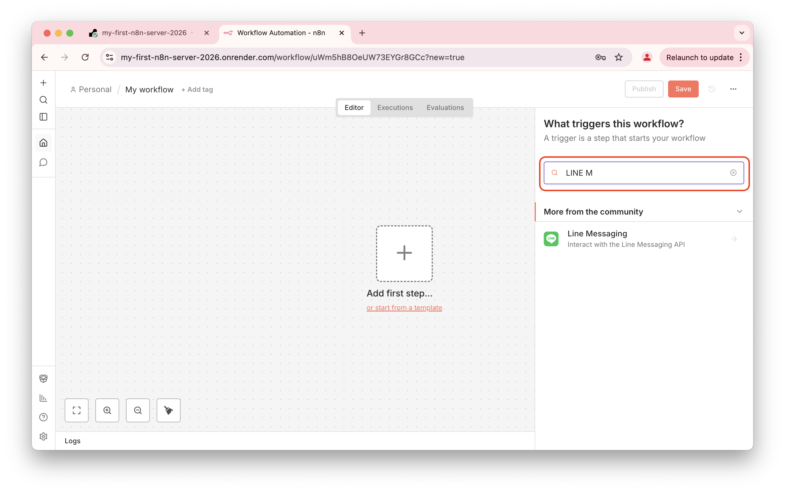
3. คุณจะเห็น "Line Messaging" ให้คลิกเลือก จะปรากฏหน้าต่างรายละเอียด Node ให้กดปุ่ม **"Install node"**
   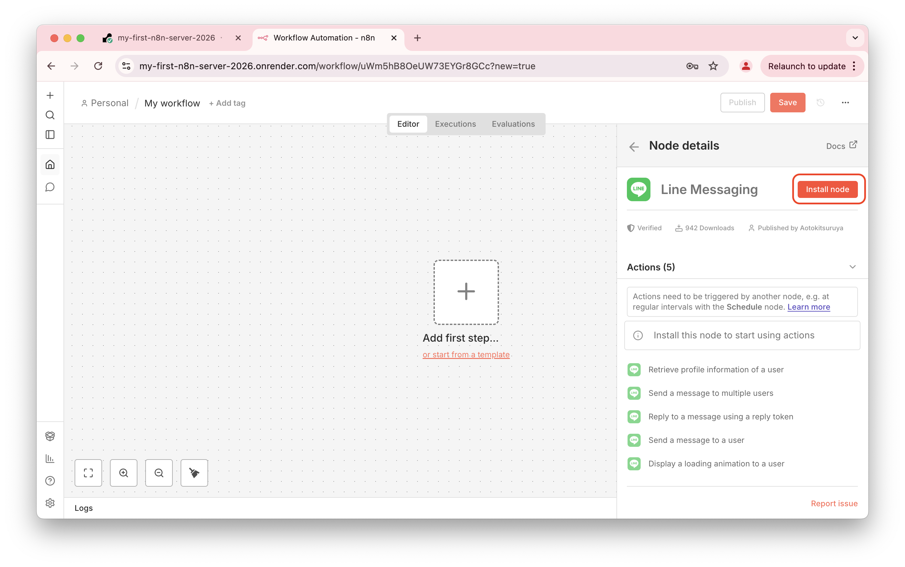
4. เมื่อติดตั้งเสร็จ ในส่วนของ Trigger เลือก **On all**
   

### ขั้นตอนที่ 3: ตั้งค่าการเชื่อมต่อ (Credentials)

1. ที่ช่อง **Credential to connect with** ให้เลือก **"Create new credential"**
   
2. นำข้อมูลจาก LINE Developers Console มากรอก:
   - **Channel Access Token**
   - **Channel Secret**
   
   เมื่อกรอกครบกด **Save**
   
   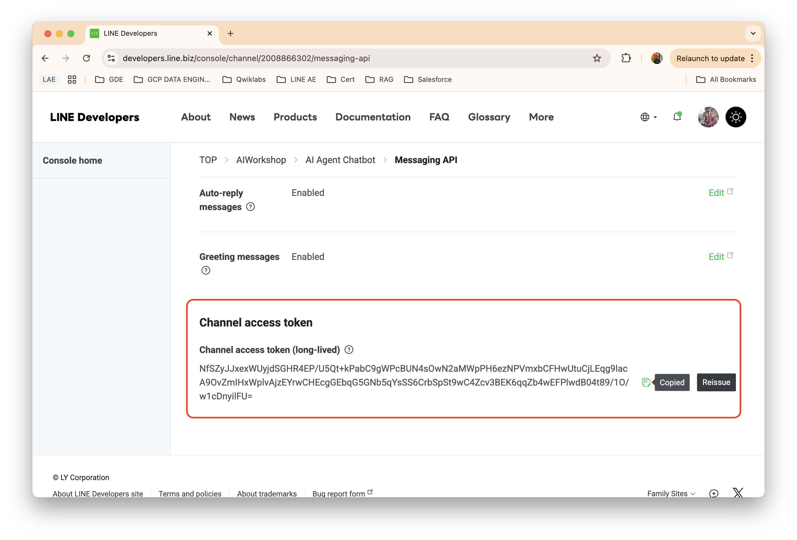
   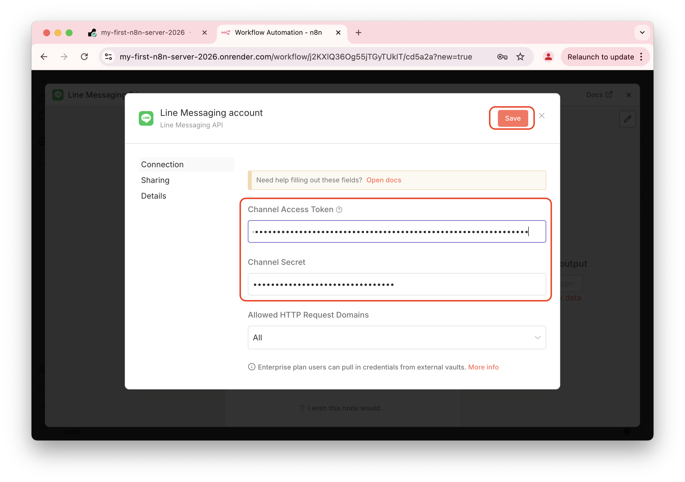
   

### ขั้นตอนที่ 4: เพิ่ม Reply Node

1. จาก Node Line Messaging Trigger กด **+** เพื่อเพิ่ม Node ใหม่ที่เป็นการตอบกลับข้อความจาก LINE
   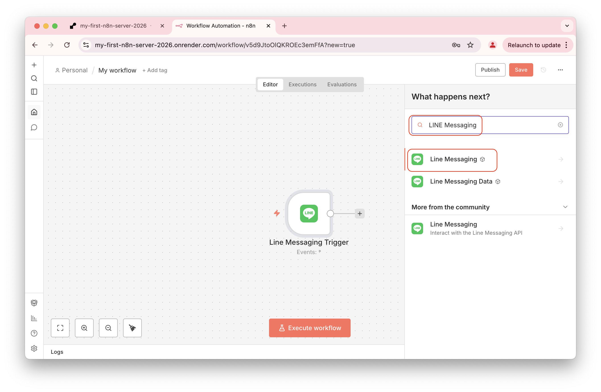
2. เลือก **"Reply to a message using a reply token"**
   
3. ตั้งค่า **Reply Token** และ **Text**
   - ในช่อง Reply Token ให้ใส่ค่า: `{{ $("Line Messaging Trigger").item.json.replyToken }}`
   - ในส่วนของการตอบกลับ ให้กดปุ่ม **"Add Message"** แล้วพิมพ์ข้อความที่ต้องการ
   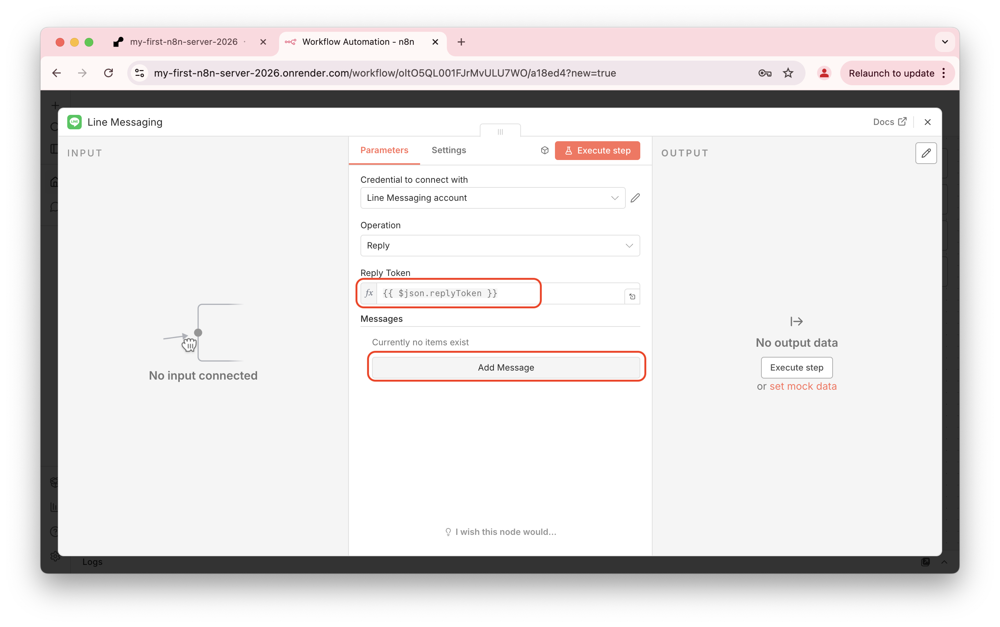

### ขั้นตอนที่ 5: ตั้งค่า Webhook URL ใน LINE

1. ในหน้าตั้งค่า Node ส่วนของ **Webhook URLs** ให้คลิกเลือก **"Production URL"**
   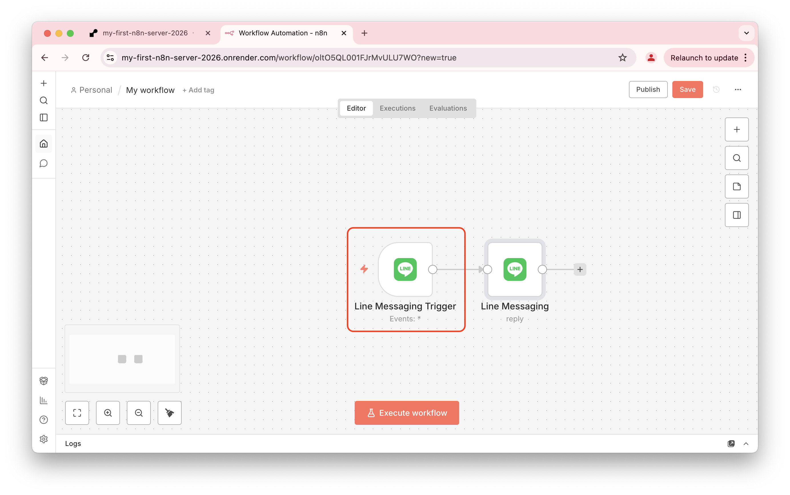
2. คลิกที่ URL เพื่อคัดลอก (จะเป็น `https://[ชื่อแอป].onrender.com/webhook/...`)
   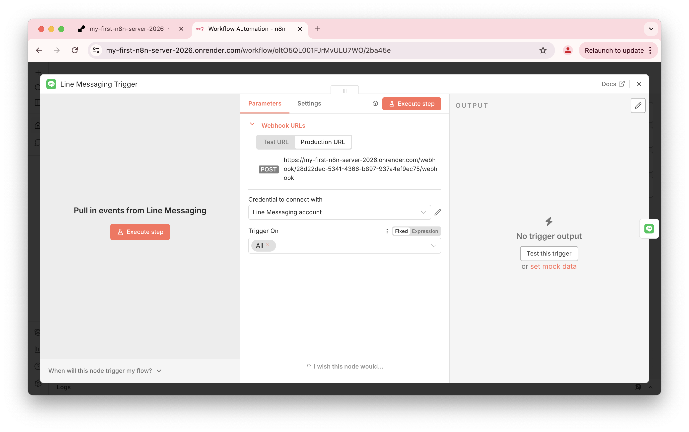
3. กดปุ่ม **Save** มุมขวาบนแล้วตั้งชื่อ Workflow จากนั้นกด **Publish** (หรือเปิดสวิตช์ Active)
    
    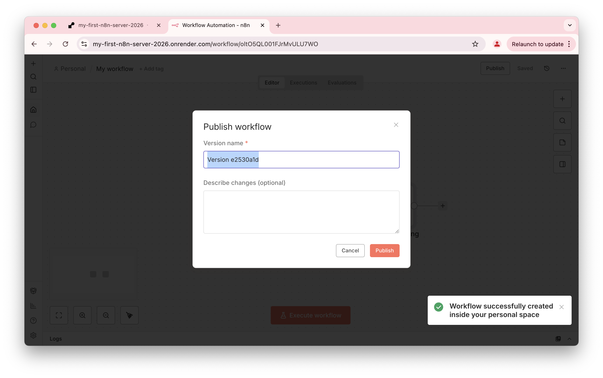
   <aside class="positive">
    <strong>สำคัญ:</strong> ต้องกด **Publish** ให้สถานะเป็นสีเขียว เพื่อให้ Bot ทำงานได้จริงเมื่อเชื่อมต่อ
   </aside>
   
4. นำ URL ที่คัดลอกไว้ ไปวางในช่อง **Webhook settings** ที่หน้า LINE Developers Console แล้วกด **Verify**
    
5. เมื่อ Verify ผ่าน ให้กดเปิดสวิตช์ **Use webhook**
    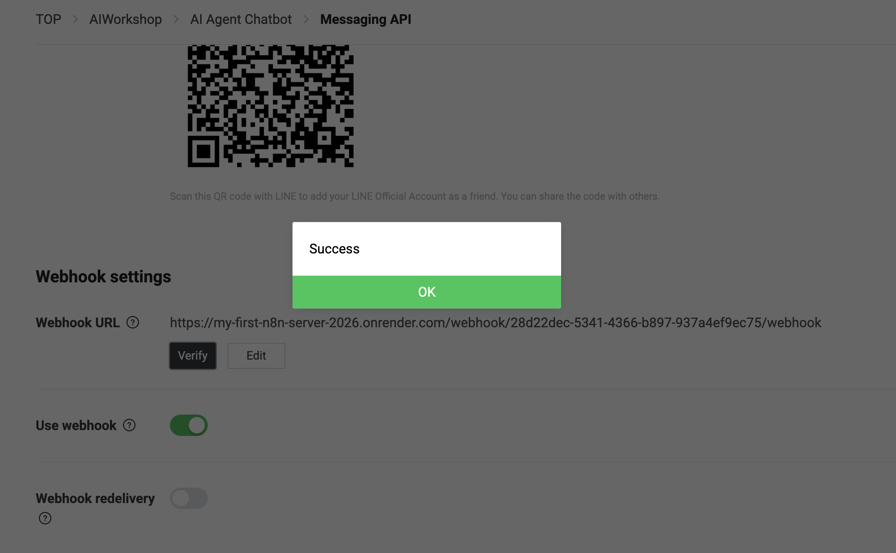

### ขั้นตอนที่ 6: ทดสอบผ่าน LINE บนมือถือ
จะเห็นได้ว่า n8n workflow นี้สามารถตอบกลับเป็นข้อความอัตโนมัติได้
### ขั้นตอนที่ 7: ตรวจสอบการทำงานของ Workflow บน n8n
<aside class="positive">
<strong>Tip:</strong> ใช้ n8n Execution Log เพื่อ debug และดูข้อมูลที่ผ่านแต่ละ node
</aside>

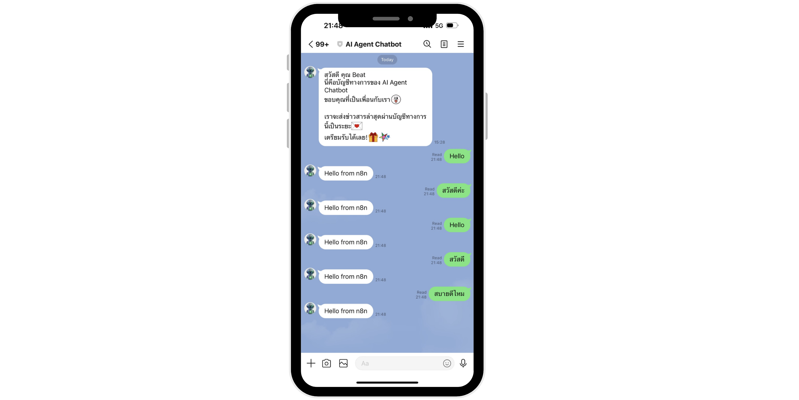

## ทำความรู้จัก AI Agent
Duration: 0:15:00


**AI Agent** คือบอทที่ใช้ AI/LLM เพื่อเข้าใจและตอบคำถาม:

- **เข้าใจความหมาย**: เข้าใจความหมายของข้อความแม้จะใช้คำต่างกัน
- **ตอบตามบริบท**: จำบริบทการสนทนาได้


**ตัวอย่าง AI Agent:**

```
ผู้ใช้: "สวัสดี"
AI: "สวัสดีครับ ยินดีให้บริการ มีอะไรให้ช่วยไหมครับ?"

ผู้ใช้: "ราคาเท่าไหร่"
AI: "ราคาสินค้าคือ 100 บาทครับ มีส่วนลด 10% สำหรับสมาชิก"

ผู้ใช้: "ถ้าซื้อ 2 ชิ้นล่ะ"
AI: "ถ้าซื้อ 2 ชิ้น ราคารวม 180 บาท (ลด 20 บาท) ครับ"
```


### Context (บริบท)

**Context** คือข้อมูลที่เกี่ยวข้องกับการสนทนา:
- **Conversation History**: ประวัติการสนทนาก่อนหน้า

### Tool Calling (Function Calling)

**Tool Calling** คือความสามารถของ AI Agent ในการเรียกใช้ tools:

- **ค้นหาข้อมูล**: เรียก API เพื่อค้นหาข้อมูล
- **คำนวณ**: เรียก function เพื่อคำนวณ
- **บันทึกข้อมูล**: เรียก API เพื่อบันทึกข้อมูล
- **ส่งขอ: เรียก service เพื่อส่งการแจ้งเตือน

เมื่อผู้ใช้ถาม "ราคาสินค้า A เท่าไหร่" AI Agent จะ:
1. เรียก `get_product_price("A")` → ได้ราคา 100 บาท
2. ตอบกลับ: "ราคาสินค้า A คือ 100 บาทครับ"


### ตัวอย่าง Use case ของ AI Agent บน LINE

### 1. Customer Service Agent

**หน้าที่:**
- ตอบคำถามเกี่ยวกับสินค้าและบริการ
- ช่วยแก้ไขปัญหา
- ให้คำแนะนำ

**ตัวอย่าง:**
```
ผู้ใช้: "สินค้าชำรุดจะคืนได้ไหม"
AI: "ได้ครับ คุณสามารถคืนสินค้าได้ภายใน 7 วันหลังจากได้รับสินค้า 
     กรุณาเตรียมใบเสร็จและสินค้าให้พร้อม แล้วติดต่อเราได้ที่..."
```

### 2. E-commerce Shopping Assistant

**หน้าที่:**
- แนะนำสินค้า
- ช่วยเลือกสินค้า
- ตอบคำถามเกี่ยวกับสินค้า

**ตัวอย่าง:**
```
ผู้ใช้: "อยากได้เสื้อผ้าสำหรับไปเที่ยวทะเล"
AI: "แนะนำเสื้อผ้าที่ทำจากผ้าแห้งเร็วและกัน UV ครับ 
     มีสินค้าให้เลือกดังนี้..."
```

### 3. Order Tracking Agent

**หน้าที่:**
- ตอบคำถามเกี่ยวกับสถานะออเดอร์
- แจ้งเตือนการจัดส่ง
- ช่วยแก้ไขปัญหาการสั่งซื้อ

**ตัวอย่าง:**
```
ผู้ใช้: "ออเดอร์ #12345 อยู่ไหน"
AI: "ออเดอร์ #12345 กำลังจัดส่งอยู่ครับ 
     คาดว่าจะถึงวันพรุ่งนี้ เวลา 14:00-16:00 น."
```

### 4. Appointment Booking Agent

**หน้าที่:**
- จองนัดหมาย
- ยืนยันการจอง
- แจ้งเตือนก่อนนัด

**ตัวอย่าง:**
```
ผู้ใช้: "อยากจองนัดวันพรุ่งนี้ 14:00"
AI: "มีเวลาว่างให้จองได้ครับ ยืนยันการจองหรือไม่?"
```


### สร้าง AI Agent บน n8n ด้วย Gemini

### ภาพรวม Gemini และความสามารถด้าน Agent

### Google Gemini คืออะไร

**Google Gemini** เป็น Large Language Model (LLM) ที่พัฒนาโดย Google:

- **Multimodal**: รองรับ text, image, audio, video
- **Fast**: ตอบกลับเร็ว
- **Free Tier**: มี free tier สำหรับทดสอบ
- **API**: มี REST API ที่ใช้งานง่าย


## สร้าง AI Agent Node บน n8n

### ขั้นตอนที่ 1: เพิ่ม AI Agent Node
  messageText: `{{ $("Line Messaging Trigger").item.json.message.text }}`
  
{{ $("Line Messaging Trigger").item.json.source.userId }}

### ขั้นตอนที่ 1: รับ Gemini API Key
1. ไปที่ [Google AI Studio](https://aistudio.google.com/)
2. ไปที่หน้า API Key และ คัดลอก API Key และเก็บไว้อย่างปลอดภัย


### 11.1 เพิ่ม Context/Memory

เพื่อให้บอทจำบริบทการสนทนา:


## เพิ่ม Agents Tools ในการส่ง Flex Message
## ปรับปรุง Instruction ให้ Agent ตอบได้ตามโจทย์ธุรกิจ


## Congratulations
Duration: 0:05:00

ใน codelab นี้ คุณได้เรียนรู้:

✅ วิธีการ deploy n8n บน Render  
✅ วิธีการตั้งค่า LINE Messaging API  
✅ วิธีการสร้าง n8n workflow บน Render  
✅ วิธีการเชื่อมต่อกับ AI Model  
✅ วิธีการส่งคำตอบกลับไปยัง LINE  
✅ Best practices สำหรับ production บน Render

### ขั้นตอนถัดไป

- เพิ่ม features เช่น context memory, multi-turn conversation
- รองรับข้อความประเภทอื่น (ภาพ, สติกเกอร์)
- เพิ่ม analytics และ monitoring
- ปรับปรุง prompt engineering เพื่อให้ได้ผลลัพธ์ที่ดีขึ้น
- พิจารณา upgrade Render plan สำหรับ production

### ทรัพยากรเพิ่มเติม

- [LINE Messaging API Documentation](https://developers.line.biz/en/docs/messaging-api/)
- [n8n Documentation](https://docs.n8n.io/)
- [Render Documentation](https://render.com/docs)
- [OpenAI API Documentation](https://platform.openai.com/docs/)


