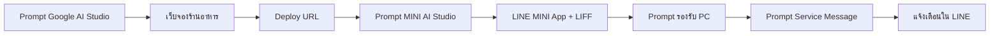
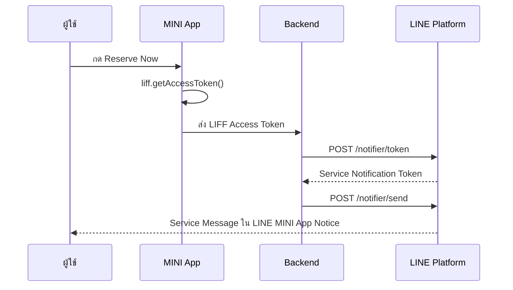
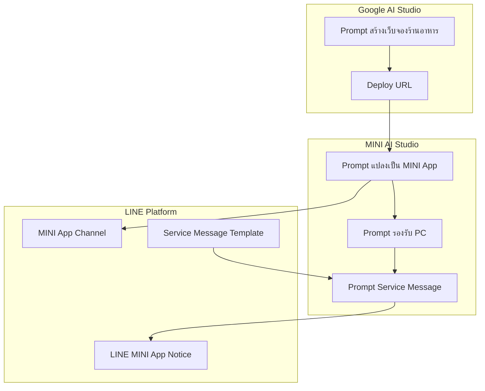

id: vibe-coding-line-mini-app-with-ai-studio
title: Vibe Coding LINE MINI App with AI Studio
summary: Codelab นี้สอนการสร้างเว็บจองร้านอาหารด้วย Google AI Studio แปลงเป็น LINE MINI App และส่ง Service Message ทั้งหมดด้วย Prompt ใน AI Studio
authors: Punsiri Boonyakiat
categories: LINE MINI App, AI Studio
tags: LINE MINI App, AI Studio, Vibe Coding, Service Message
status: Published
url: vibe-coding-line-mini-app-with-ai-studio
Feedback Link: https://forms.gle/xXkqeFE3vLSubP1f9

# Vibe Coding LINE MINI App with AI Studio

## บทนำ
Duration: 0:05:00

"ถ้าคุณมีเว็บไซต์ที่ใช้งานอยู่แล้ว — หรือสร้างเว็บจองร้านอาหารจาก Prompt ใน Google AI Studio — คุณสามารถ **แปลงเว็บให้เป็น LINE MINI App** ด้วยการ Prompt ใน MINI AI Studio ได้"

Codelab นี้ออกแบบสำหรับ Workshop แบบ Hands-on เริ่มจาก **Prompt สร้างเว็บจองร้านอาหาร** ใน Google AI Studio จากนั้น **แปลงเว็บให้เป็น LINE MINI App** ด้วย MINI AI Studio ทุกขั้นตอนทำผ่านการ **ใส่ Prompt ใน AI Studio**:

| ช่วง | หัวข้อ | ผู้นำ | เครื่องมือ |
|:---|:---|:---|:---|
| 1 | สร้างเว็บจองร้านอาหาร | P'Golf | [Google AI Studio](https://aistudio.google.com/) |
| 2 | แปลงเว็บเป็น LINE MINI App | Sitthi | MINI AI Studio |
| 3 | ให้ MINI App ใช้งานบน PC ได้ | Prompt | MINI AI Studio |
| — | **พัก** | — | — |
| 4 | แนะนำ Service Message + ตั้งค่า Template | — | LINE Developers Console |
| 5 | Implement Service Message ใน MINI App | — | MINI AI Studio |

### สิ่งที่คุณจะได้ลงมือทำ

- สร้างเว็บจองร้านอาหาร (Restaurant Reservation) ด้วย Prompt ใน Google AI Studio
- Deploy เว็บและแปลงให้เป็น LINE MINI App ด้วย Prompt ใน MINI AI Studio
- เชื่อม LIFF API และ Deploy ไปยัง LINE MINI App Channel
- ปรับ MINI App ให้รองรับ External Browser (PC / Desktop)
- ตั้งค่า Service Message Template และส่งการยืนยันการจองโต๊ะหลังผู้ใช้กด Reserve Now

### สิ่งที่คุณจะได้เรียนรู้

- **Vibe Coding**: สร้างและแปลงแอปจาก Prompt แทนการเขียนโค้ดเอง
- **Google AI Studio Build Mode**: สร้างและ Deploy เว็บจองร้านอาหารจาก Prompt
- **LINE MINI App**: โครงสร้าง Channel, LIFF, Endpoint URL
- **MINI AI Studio**: Multi-Agent ที่ช่วย Build & Ship MINI App จากเว็บเดิม
- **External Browser**: ให้ MINI App ทำงานบนเว็บเบราว์เซอร์ PC ได้
- **Service Message**: ส่งการแจ้งเตือนยืนยันให้ผู้ใช้ใน LINE

### สิ่งที่คุณต้องเตรียมพร้อมก่อนเริ่ม Codelab

- **เว็บไซต์ที่ Deploy แล้ว** – สร้างจาก Session 1 หรือใช้ URL เว็บของคุณเอง (HTTPS)
- **แอปพลิเคชัน LINE บนสมาร์ทโฟน** ที่เข้าสู่ระบบเรียบร้อยแล้ว
- [**บัญชี Google**](https://accounts.google.com/signup) – สำหรับ Google AI Studio
- [**บัญชี LINE Developers**](https://developers.line.biz/console/) – สำหรับสร้าง LINE MINI App Channel
- **สิทธิ์เข้าใช้ MINI AI Studio** – เครื่องมือ Build & Ship LINE MINI App ด้วย Prompt (ขอ Access จากทีมงาน Workshop)
- **เบราว์เซอร์ Chrome หรือ Edge** บนคอมพิวเตอร์

<aside class="positive">
<strong>Note:</strong> ถ้ามีเว็บจองของตัวเองอยู่แล้ว สามารถข้าม Session 1 และใช้ URL เว็บเดิมแทนได้
</aside>

## ทำความรู้จัก Vibe Coding และ AI Studio
Duration: 0:10:00

### Vibe Coding คืออะไร?

**Vibe Coding** คือวิธีพัฒนาแอปพลิเคชันโดยอธิบาย "สิ่งที่ต้องการ" ด้วยภาษาธรรมชาติ (Prompt) แล้วให้ AI สร้าง UI, Logic และการเชื่อมต่อระบบให้แทน

แทนที่จะ:
1. อ่านโค้ดเว็บเดิม → เขียน LIFF integration เอง → Deploy → แก้ bug ทีละจุด

คุณจะ:
1. ระบุ URL เว็บเดิม + Spec → Prompt ใน MINI AI Studio → AI แปลงเป็น MINI App → ทดสอบ → ปรับ Prompt ซ้ำจนพอใจ

### เครื่องมือที่ใช้ใน Workshop นี้

#### Google AI Studio (Build Mode)
ใช้สร้าง **เว็บจองร้านอาหาร** ตั้งแต่ UI จนถึง Deploy บน Cloud

- เข้าได้ที่ [aistudio.google.com](https://aistudio.google.com/)
- เลือก **Build** หรือ **Vibe Code** แล้ววาง Prompt จาก Session P'Golf

#### MINI AI Studio
ใช้สำหรับ **Build & Ship LINE MINI App** โดย AI ทำงานเป็น Multi-Agent:

| Agent | หน้าที่ |
|:---|:---|
| Supervisor Agent | วิเคราะห์ Prompt และแจกงาน |
| UI/Logic Agent | สร้าง UI และ Business Logic |
| LIFF Agent | เชื่อมต่อ LIFF API |
| Validator Agent | ตรวจสอบและแก้ไขจนกว่าจะผ่าน |

#### LINE Developers Console
ใช้จัดการ **LINE MINI App Channel**, ตั้งค่า Endpoint URL และ **Service Message Template**

### ภาพรวม Flow ของ Workshop



## สร้างเว็บจองร้านอาหาร (P'Golf)
Duration: 0:45:00

ในช่วงนี้ P'Golf จะใช้ **Google AI Studio** สร้างเว็บจองร้านอาหารแบบ Premium ด้วย Prompt — ไม่ต้องเขียนโค้ดเอง

### ขั้นตอนที่ 1: เปิด Google AI Studio

1. ไปที่ [Google AI Studio](https://aistudio.google.com/)
2. เข้าสู่ระบบด้วยบัญชี Google
3. คลิก **Build** หรือ **Vibe Code** เพื่อเริ่มโปรเจกต์ใหม่

### ขั้นตอนที่ 2: Prompt สร้างเว็บจองร้านอาหาร (Copy & Paste)

วาง Prompt ด้านล่างนี้ใน Google AI Studio แล้วกด **Generate**:

```
Create a modern mobile-first restaurant reservation app inspired by premium dining reservation experiences.

Design Style:
- Clean, elegant, and minimal
- White background
- Soft gray cards and borders
- Green accent color (#00C853)
- Rounded corners (20-24px)
- Spacious layout
- Large touch-friendly controls
- Premium restaurant feel
- Suitable for LINE MINI App

Reservation Flow:

1. Guest Selector Card
- Display "Number of Guests"
- Minus button
- Guest count in center
- Plus button
- Default value = 2

2. Dining Date Section
- Section title: "Select Dining Date"
- Horizontal date picker cards
- Today highlighted in green
- Other dates in white
- Display selected full date above the date cards

3. Preferred Time Section
- Section title: "Select Preferred Time"

Lunch Slots:
- 11:30
- 12:00
- 12:30
- 13:00
- 13:30
- 14:00

Dinner Slots:
- 17:30
- 18:00
- 18:30
- 19:00
- 19:30
- 20:00
- 20:30
- 21:00

Display each time slot as rounded selectable buttons.

Selected state:
- Green background
- White text

Unselected state:
- White background
- Dark gray text
- Light gray border

4. Customer Details Section
Fields:
- Full Name
- Mobile Number
- Special Request (optional)

5. Reservation Summary Card
Display:
- Date
- Time
- Number of Guests
- Customer Name

6. Reserve Now Button
- Full width
- Green background
- Fixed at bottom on mobile
- Large rounded button

Functionality:
- Users select date
- Users select time
- Users enter customer details
- Users tap Reserve Now

Implement one mock function: createReservation()
```

<aside class="positive">
<strong>Tip:</strong> ถ้า UI ยังไม่ตรงใจ ให้ใช้ **Annotation Mode** วาดวงรอบส่วนที่ต้องการแก้ แล้ว Prompt เพิ่ม เช่น "เปลี่ยนชื่อร้านเป็น The Green Table" หรือ "เพิ่มโลโก้ร้านด้านบน"
</aside>

### ขั้นตอนที่ 3: Prompt ปรับปรุง (ถ้าจำเป็น)

```
Improve the restaurant reservation app:
- Add restaurant name "The Green Table" and tagline at the top
- Validate mobile number must be 10 digits
- Disable past dates in date picker
- Show confirmation screen after Reserve Now with reservation ID
- Store reservations in localStorage for demo
- All labels can stay in English or translate key labels to Thai
```

### ขั้นตอนที่ 4: Deploy เว็บ

เมื่อ Preview ใช้งานได้แล้ว ให้ Deploy เพื่อได้ URL สาธารณะ:

1. คลิก **Deploy** ใน Google AI Studio
2. เลือก Deploy ไปยัง **Google Cloud Run** (หรือตัวเลือกที่ AI Studio แนะนำ)
3. รอจน Deploy สำเร็จ แล้ว **คัดลอก URL** ไว้ใช้ในขั้นตอนถัดไป

<aside class="negative">
<strong>Important:</strong> เก็บ Deploy URL ไว้ให้ดี — คุณจะใช้ URL นี้แปลงเป็น LINE MINI App ใน Session ถัดไป
</aside>

### ทดสอบเว็บก่อนไปต่อ

เปิด Deploy URL บนมือถือและทดสอบการจอง 1 ครั้ง ตรวจสอบว่า:

- [ ] เลือกจำนวนแขก (+ / −) ได้
- [ ] เลือกวันที่และช่วงเวลา (Lunch / Dinner) ได้
- [ ] กรอกชื่อ เบอร์โทร และ Special Request ได้
- [ ] กด Reserve Now แล้วเห็น Summary / Confirmation
- [ ] `createReservation()` ทำงานและบันทึกข้อมูลได้

### ข้อกำหนดของเว็บก่อนแปลงเป็น MINI App

| ข้อกำหนด | รายละเอียด |
|:---|:---|
| HTTPS | URL ต้องเป็น `https://` (LINE MINI App บังคับ) |
| Public URL | เข้าถึงได้จากอินเทอร์เน็ต ไม่ใช่ localhost |
| Mobile-friendly | แสดงผลได้ดีบนมือถือ (Responsive) |
| Core flow ทำงานได้ | จองครบ Flow ก่อนแปลงเป็น MINI App |

## แปลงเว็บเป็น LINE MINI App (Sitthi)
Duration: 0:45:00

ในช่วงนี้คุณจะใช้ **MINI AI Studio** เพื่อ **แปลงเว็บที่มีอยู่แล้ว** ให้ทำงานเป็น **LINE MINI App** ผ่าน LIFF — ทุกขั้นตอนทำด้วย Prompt

### ขั้นตอนที่ 1: สร้าง LINE MINI App Channel

ก่อนใช้ MINI AI Studio ต้องมี Channel ก่อน:

1. ไปที่ [LINE Developers Console](https://developers.line.biz/console/)
2. สร้าง **Provider** (ถ้ายังไม่มี)
3. คลิก **Create a new channel** → เลือก **LINE MINI App**
4. กรอกข้อมูล:
   - **Channel name**: `Restaurant Reservation`
   - **Channel description**: `บริการจองโต๊ะร้านอาหาร The Green Table`
   - **Category**: เลือกหมวดที่เหมาะสม (เช่น Food & Drink)
5. บันทึก **Channel ID** และ **LIFF ID** จากแท็บ **Web app settings**

### ขั้นตอนที่ 2: เปิด MINI AI Studio

1. เปิด **MINI AI Studio** (ลิงก์ Access จากทีมงาน Workshop)
2. เชื่อมต่อ LINE Developers Account
3. เลือก Channel **Restaurant Reservation** ที่สร้างไว้
4. สร้าง Project ใหม่

### ขั้นตอนที่ 3: Prompt แปลงเว็บเดิมเป็น LINE MINI App

วาง Prompt นี้ใน MINI AI Studio (แทนที่ `YOUR_WEBSITE_URL` ด้วย URL เว็บจริง):

```
Convert my existing restaurant reservation website into a LINE MINI App. Do NOT redesign or rebuild the website from scratch — preserve the existing UI, pages, and business logic as much as possible.

App name: Restaurant Reservation
Existing website URL: YOUR_WEBSITE_URL

Conversion requirements:
- Import and adapt the existing web app (guest selector, date picker, time slots, customer form, summary, Reserve Now button)
- Add LIFF SDK: initialize with liff.init() on app load
- Integrate liff.getProfile() to auto-fill Full Name from LINE profile
- Show LINE profile picture on the header greeting: "Welcome, {displayName}"
- Keep createReservation() and all existing reservation logic unchanged
- Preserve green accent (#00C853) premium restaurant design
- Mobile-first design optimized for LINE in-app browser

Do NOT implement Service Message yet — we will add that in a later step.
```

### ขั้นตอนที่ 4: Prompt เชื่อม LIFF Profile

หลัง AI สร้างแอปแล้ว ถ้ายังไม่ดึง Profile จาก LINE ให้ Prompt:

```
Add LIFF profile integration:
- After liff.init() succeeds, call liff.getProfile()
- Auto-fill the "Full Name" field with profile.displayName (editable)
- Show profile.pictureUrl as avatar on home page header
- If LIFF init fails, show friendly error: "กรุณาเปิดแอปผ่าน LINE MINI App"
- Handle loading state while fetching profile
```

### ขั้นตอนที่ 5: Prompt Deploy ไปยัง MINI App Channel

```
Ship the converted LINE MINI App to my Developing channel:
- Set Endpoint URL to the deployed app URL (adapted from my existing website)
- Ensure LIFF SDK is properly integrated without breaking original web functionality
- Test that the app opens from LINE MINI App LIFF URL
- Verify the original booking flow still works end-to-end inside LINE app
```

### ขั้นตอนที่ 6: ตั้งค่า Endpoint URL ใน Console (ถ้า AI ยังไม่ทำให้)

1. ไปที่ LINE Developers Console → Channel **Restaurant Reservation**
2. แท็บ **Web app settings** → **Endpoint URL**
3. วาง **URL ของแอปที่ MINI AI Studio Deploy** (แปลงจากเว็บเดิม)
4. บันทึกการตั้งค่า

### ทดสอบ MINI App บนมือถือ

1. เปิดแอป LINE บนมือถือ
2. ไปที่ **Web app settings** → คัดลอก **LIFF URL** (Developing)
3. เปิด LIFF URL ใน LINE
4. ทดสอบจองโต๊ะ 1 ครั้ง

<aside class="positive">
<strong>Tip:</strong> ถ้าแอปไม่แสดงผล ให้ Prompt ใน MINI AI Studio: "Debug LIFF initialization error and fix CORS/endpoint configuration"
</aside>

## ให้ MINI App ใช้งานบน PC ได้ (Prompt)
Duration: 0:20:00

ตั้งแต่ **ตุลาคม 2025** LINE MINI App สามารถเปิดใช้งานผ่าน **External Browser** (Chrome, Edge บน PC) ได้แล้ว ในช่วงนี้คุณจะ Prompt ให้ MINI AI Studio ปรับแอปให้รองรับ

### ทำความรู้จัก External Browser

เมื่อผู้ใช้เปิด MINI App บน PC ผ่านเบราว์เซอร์:

- `liff.init()` **จะไม่ Login อัตโนมัติ** เหมือนใน LINE App
- ต้องตั้ง `withLoginOnExternalBrowser: true` หรือเรียก `liff.login()` เอง
- ฟีเจอร์บางอย่าง (เช่น `liff.sendMessages`, `liff.scanCode`) ใช้ได้เฉพาะใน LINE App

อ้างอิง: [Open a LINE MINI App in an external browser](https://developers.line.biz/en/docs/line-mini-app/develop/external-browser/)

### ขั้นตอนที่ 1: Prompt รองรับ External Browser

วาง Prompt นี้ใน MINI AI Studio:

```
Update Restaurant Reservation MINI App to support external browser (PC/desktop):

1. Update liff.init() config:
   - Add withLoginOnExternalBrowser: true for automatic LINE Login on PC browser

2. Detect environment:
   - Use liff.isInClient() to check if running inside LINE app
   - Use liff.getContext() to get environment info

3. UI adjustments:
   - If NOT in LINE client (external browser): show a banner at top:
     "เปิดผ่าน LINE App เพื่อประสบการณ์ที่ดีที่สุด" with a link to open in LINE
   - If in external browser AND not logged in: show login button that calls liff.login()
   - Layout should work well on desktop screen (max-width container, centered)

4. Graceful degradation:
   - Booking flow must work on PC without features that require LINE in-app only
   - Profile: if liff.getProfile() unavailable, let user type name manually

5. Test checklist:
   - Works in LINE mobile app (existing behavior)
   - Works in Chrome on PC with LINE Login
   - Responsive on both mobile and desktop widths
```

### ขั้นตอนที่ 2: Prompt ปรับ Layout สำหรับ Desktop

```
Improve desktop layout for Restaurant Reservation:
- On screens wider than 768px: show two-column layout (restaurant info + reservation form)
- On mobile: keep single-column stacked layout
- Increase font size and button size on desktop for readability
- Add favicon and page title "The Green Table - Restaurant Reservation"
```

### ขั้นตอนที่ 3: Deploy และทดสอบบน PC

1. Prompt MINI AI Studio: `Deploy the updated app with external browser support to Developing channel`
2. เปิด **Endpoint URL** ใน Chrome บน PC (ไม่ผ่าน LINE App)
3. ตรวจสอบว่า LINE Login ทำงานและจองคิวได้

### Checklist ทดสอบบน PC

- [ ] เปิด Endpoint URL ใน Chrome ได้
- [ ] LINE Login ทำงาน (Auto หรือ Manual)
- [ ] จองโต๊ะครบ Flow ได้
- [ ] Layout แสดงผลดีบนหน้าจอ Desktop
- [ ] เปิดใน LINE App บนมือถือยังทำงานปกติ

## พัก ☕
Duration: 0:15:00

พักผ่อน 15 นาที ก่อนเริ่มช่วง **Service Message**

<aside class="special">
<strong>Agenda ช่วงบ่าย:</strong><br>
15:15–15:45 — แนะนำ Service Message + ตั้งค่า Template<br>
15:45–16:30 — Implement Service Message ใน MINI App (ทำผ่าน Prompt ใน MINI AI Studio)
</aside>

## แนะนำ Service Message + ตั้งค่า Template
Duration: 0:30:00

### Service Message คืออะไร?

**Service Message** เป็นฟีเจอร์ของ LINE MINI App ที่ช่วยส่ง **การแจ้งเตือนที่เกี่ยวข้องกับการกระทำของผู้ใช้** ไปยังแชท **LINE MINI App Notice** (ประเทศไทย)

ตัวอย่าง Use Case สำหรับ Restaurant Reservation:
- ยืนยันการจองโต๊ะสำเร็จ
- แจ้งเตือนก่อนถึงเวลารับประทาน 1 วัน
- แจ้งยกเลิกการจอง

<aside class="negative">
<strong>Important:</strong> Service Message ส่งได้เฉพาะเป็น **การตอบกลับ/ยืนยันจาก action ของผู้ใช้ใน MINI App** — ห้ามใช้ส่งโฆษณา โปรโมชัน หรือข้อมูลที่ไม่เกี่ยวกับ action นั้น
</aside>

### เงื่อนไขสำคัญ

| หัวข้อ | รายละเอียด |
|:---|:---|
| Verified MINI App | ฟีเจอร์เต็มรูปแบบใช้ได้กับ Verified MINI App |
| Developing Channel | ทดสอบส่งได้กับ Admin/Tester บน Developing channel |
| Token อายุ | Service Notification Token อายุ **1 ปี** |
| จำนวนข้อความ | ส่งได้สูงสุด **5 ข้อความ** ต่อ 1 user action |
| Template Review | Template ต้องผ่าน Review ก่อนใช้บน Production |

อ้างอิง: [Sending service messages](https://developers.line.biz/en/docs/line-mini-app/develop/service-messages/)

### โครงสร้าง Service Message

Service Message ประกอบด้วย 4 ส่วน:

| ส่วน | คำอธิบาย |
|:---|:---|
| A. Title | หัวข้อหลัก + Subtitle |
| B. Detail | รายละเอียด (simple หรือ detailed layout) |
| C. Button | ปุ่มลิงก์ไปหน้า MINI App (Permanent Link) |
| D. Footer | ไอคอน + ชื่อ MINI App |

### Flow การส่ง Service Message



### ขั้นตอนที่ 1: Prompt ใน MINI AI Studio — วางแผน Service Message

ก่อนตั้งค่า Template ให้ Prompt วางแผน Implementation:

```
Plan Service Message integration for Restaurant Reservation MINI App.

Use case: When a user taps Reserve Now and createReservation() succeeds, send a service message confirming the reservation.

Define:
1. Which template category fits best (store reservation / restaurant booking confirmation)
2. Template variables needed: date, time, number of guests, reservation ID, customer name
3. Server-side flow: issue notification token → send message → save token for follow-up
4. API endpoints: POST /notifier/token and POST /notifier/send
5. Error handling if token issuance fails

Output the implementation plan only — do not code yet.
```

### ขั้นตอนที่ 2: ตั้งค่า Service Message Template ใน Console

1. ไปที่ [LINE Developers Console](https://developers.line.biz/console/)
2. เลือก Channel **Restaurant Reservation** (Developing)
3. เปิดแท็บ **Service message template**
4. คลิก **Add**
5. เลือก Template หมวด **Store reservation** หรือ **Booking confirmation** (ภาษา **Thai**)
6. กรอก **Use Case**:

```
ใช้ส่งข้อความยืนยันการจองโต๊ะร้านอาหาร เมื่อผู้ใช้กด Reserve Now สำเร็จใน LINE MINI App เท่านั้น
```

7. กรอก JSON ตัวอย่าง Template Variables:

```json
{
  "date": "9 มิ.ย. 2026",
  "time": "19:00",
  "guests": "2",
  "reservation_id": "RES-20260609-001",
  "customer_name": "คุณสมชาย"
}
```

8. คลิก **Send** ใน Preview เพื่อส่ง Test Message ไป LINE ของคุณ
9. คลิก **Add** เพื่อบันทึก Template
10. จด **Template name for API use** (รูปแบบ `{template_name}_th`)

<aside class="positive">
<strong>Tip:</strong> ขณะ Review ยังไม่เสร็จ คุณยัง **ส่ง Test Message จาก Simulator** และ **เพิ่ม Template ใหม่** ได้บน Developing channel
</aside>

### ขั้นตอนที่ 3: Prompt สร้าง JSON params สำหรับ Template

```
Based on the restaurant reservation confirmation service message template I added to my LINE MINI App channel, generate the params JSON mapping for a reservation with these fields:
- date (Thai format, e.g. "9 มิ.ย. 2026")
- time (24h format, e.g. "19:00")
- guests (number as string)
- reservation_id (format: RES-YYYYMMDD-XXX)
- customer_name (from LIFF profile or form input)
- button_uri_1 (permanent link to reservation detail page in MINI App)

Show the exact params object I should send to POST /notifier/send API.
Template name: [paste your template name here]_th
```

## Implement Service Message ใน MINI App
Duration: 0:45:00

ในช่วง 15:45–16:30 คุณจะใช้ **MINI AI Studio Prompt** ทั้งหมด เพื่อ Implement การส่ง Service Message หลังจองสำเร็จ

### ขั้นตอนที่ 1: Prompt สร้าง Backend สำหรับ Service Message API

```
Implement server-side Service Message API for Restaurant Reservation MINI App.

Requirements:
1. Create API endpoint POST /api/service-message/send-reservation-confirmation
   - Input: { liffAccessToken, reservation: { date, time, guests, reservationId, customerName } }
   - Steps:
     a. Get stateless channel access token from LINE
     b. POST to https://api.line.me/message/v3/notifier/token with liffAccessToken
     c. POST to https://api.line.me/message/v3/notifier/send?target=service with:
        - templateName: "[YOUR_TEMPLATE_NAME]_th"
        - notificationToken from step b
        - params: { date, time, guests, reservation_id, customer_name, button_uri_1 }
     d. Return { success, notificationToken, remainingCount }

2. Store notificationToken keyed by reservationId for future reminders

3. Environment variables needed:
   - LINE_CHANNEL_ID
   - LINE_CHANNEL_SECRET (for stateless token)

4. Error handling:
   - Invalid LIFF token → 401 with Thai error message
   - Template not found → log and return friendly error
   - Token remainingCount = 0 → warn but don't crash

Use Node.js/Express or the stack already in this project.
Do NOT hardcode channel access token — use stateless token API.
```

<aside class="negative">
<strong>Important:</strong> ใช้ **Stateless Channel Access Token** สำหรับ LINE MINI App — ห้ามใช้ Long-lived token
</aside>

### ขั้นตอนที่ 2: Prompt เชื่อม MINI App Frontend กับ Service Message

```
Update Restaurant Reservation MINI App frontend to send service message after successful reservation:

1. After user taps Reserve Now and createReservation() succeeds:
   - Get LIFF access token via liff.getAccessToken()
   - Call POST /api/service-message/send-reservation-confirmation with reservation data

2. UX flow:
   - Show loading spinner: "Sending confirmation to LINE..."
   - On success: show "✅ Confirmation sent to LINE MINI App Notice"
   - On failure: still show reservation success but warn "Could not send notification — please save your Reservation ID"

3. Only send service message when liff.isLoggedIn() is true

4. Pass button_uri_1 as permanent link to reservation detail page with reservationId query param

Test that the full flow works: reserve → confirm → receive service message in LINE.
```

### ขั้นตอนที่ 3: Prompt สร้างหน้า Booking Detail สำหรับปุ่มใน Service Message

```
Add a booking detail page to P'Golf MINI App:

Route: /booking-detail?bookingId=PG-YYYYMMDD-XXX

Features:
- Load booking from localStorage/database by bookingId
- Display: date, time, players, customer name, booking status
- Button "ยกเลิกการจอง" (cancel booking, update status)
- This page URL will be used as button_uri_1 in service message params
- Support opening from service message button tap inside LINE
```

### ขั้นตอนที่ 4: Prompt ส่ง Reminder Message (ข้อความที่ 2)

```
Implement a follow-up service message (reminder) for Restaurant Reservation:

Use case: Send reminder 1 day before dining time (for demo, add a "Send Test Reminder" button on reservation detail page)

Requirements:
1. Use the notificationToken saved from the first service message (do NOT re-issue token)
2. Use a reminder template (e.g. reservation_reminder_th)
3. API: POST /api/service-message/send-reminder
   - Input: { notificationToken, reservationId }
   - Check remainingCount > 0 before sending
4. Update stored notificationToken from API response after each send

Add the "Send Test Reminder" button on reservation detail page for workshop demo purposes.
```

### ขั้นตอนที่ 5: Prompt Deploy และทดสอบ End-to-End

```
Deploy Restaurant Reservation MINI App with Service Message integration:

1. Deploy backend and frontend to Developing environment
2. Update Endpoint URL in LINE Developers Console if changed
3. Run end-to-end test checklist:
   - Open MINI App in LINE on mobile
   - Complete a reservation (select guests, date, time, tap Reserve Now)
   - Verify service message appears in "LINE MINI App Notice" chat
   - Tap button in service message → opens reservation detail page
   - Tap "Send Test Reminder" → second service message received
4. Report any errors and fix them
```

### Checklist ทดสอบ Service Message

- [ ] Template ถูก Add ใน Console แล้ว
- [ ] Test Message จาก Console Preview ส่งได้
- [ ] จองโต๊ะใน MINI App แล้วได้รับ Service Message
- [ ] ข้อมูลใน Message ตรงกับการจอง (วัน, เวลา, จำนวนแขก)
- [ ] กดปุ่มใน Message เปิดหน้า Reservation Detail ได้
- [ ] (Optional) ส่ง Reminder ข้อความที่ 2 ได้

### Troubleshooting — Prompt แก้ปัญหา

ถ้า Service Message ไม่ส่ง ให้ Prompt ใน MINI AI Studio:

```
Debug Service Message failure for Restaurant Reservation:

Symptoms: [describe what happens, e.g. "API returns 400 template not found"]

Check and fix:
1. templateName format matches Console exactly ({name}_th)
2. All required template variables are in params
3. LIFF access token is fresh (call getAccessToken right before API call)
4. Using stateless channel access token, not long-lived
5. Channel is Developing and user is Admin/Tester
6. Log full API request/response for debugging

Fix the issue and redeploy.
```

## สรุปและ Next Steps
Duration: 0:05:00

### สิ่งที่คุณได้สร้างใน Workshop นี้



### สรุป Prompt Workflow

| ลำดับ | งาน | เครื่องมือ |
|:---|:---|:---|
| 1 | สร้างเว็บจองร้านอาหาร | Google AI Studio |
| 2 | แปลงเว็บเป็น LINE MINI App + LIFF | MINI AI Studio |
| 3 | รองรับ External Browser (PC) | MINI AI Studio |
| 4 | ตั้งค่า Service Message Template | LINE Developers Console |
| 5 | Implement ส่ง Service Message | MINI AI Studio |

### เทคนิค Prompt ที่ได้เรียนรู้

- **Zero-shot**: อธิบาย requirement ครบในครั้งเดียว
- **Iterative**: ปรับ UI/Logic ทีละ Prompt หลัง Preview
- **Few-shot**: ให้ตัวอย่าง JSON params สำหรับ Template
- **Debug Prompt**: อธิบาย symptom ให้ AI แก้ไข

### Next Steps

- ส่ง **Verification Review** เพื่อเปิดใช้ Service Message บน Production
- เพิ่ม Template Reminder สำหรับแจ้งเตือนก่อนถึงเวลานัด
- เชื่อม **Backend จริง** ของเว็บเดิม (ถ้ามี) แทนการเก็บข้อมูลฝั่ง client
- ศึกษา [LINE MINI App Documentation](https://developers.line.biz/en/docs/line-mini-app/) เพิ่มเติม

<aside class="special">
<strong>Feedback:</strong> ช่วยให้คะแนนและข้อเสนอแนะ Workshop ผ่าน <a href="https://forms.gle/xXkqeFE3vLSubP1f9" target="_blank">แบบสอบถาม</a>
</aside>

## อ้างอิง

- [Google AI Studio](https://aistudio.google.com/)
- MINI AI Studio — Build & Ship LINE MINI App with Prompt (Workshop Access)
- [LINE MINI App Documentation](https://developers.line.biz/en/docs/line-mini-app/)
- [Sending service messages](https://developers.line.biz/en/docs/line-mini-app/develop/service-messages/)
- [Open MINI App in external browser](https://developers.line.biz/en/docs/line-mini-app/develop/external-browser/)
- [LINE MINI App API Reference](https://developers.line.biz/en/reference/line-mini-app/)
- [Build & Ship LINE MINI App with MINI AI Studio (Speaker Deck)](https://speakerdeck.com/linedevth/build-and-ship-line-mini-app-with-mini-ai-studio)
