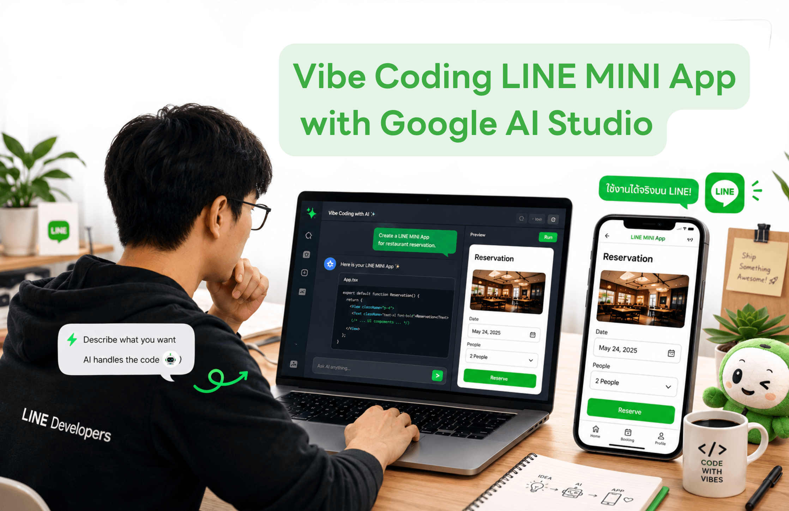
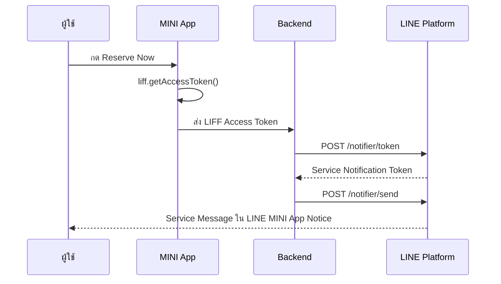

id: vibe-coding-line-mini-app
title: Vibe Coding LINE MINI App with AI Studio
summary: Codelab นี้สอนการสร้างเว็บจองร้านอาหาร แปลงเป็น LINE MINI App และส่ง Service Message ทั้งหมดด้วย Prompt ใน Google AI Studio
authors: Punsiri Boonyakiat
categories: LINE MINI App, AI Studio
tags: LINE MINI App, AI Studio, Vibe Coding, Service Message
status: Published
url: vibe-coding-line-mini-app
Feedback Link: https://forms.gle/xXkqeFE3vLSubP1f9

# Vibe Coding LINE MINI App with AI Studio

## บทนำ
Duration: 0:05:00

"ถ้าคุณมีเว็บไซต์ที่ใช้งานอยู่แล้ว — หรือสร้างเว็บจองร้านอาหารจาก Prompt ใน Google AI Studio — คุณสามารถ **แปลงเว็บให้เป็น LINE MINI App** ด้วยการ Prompt ใน Google AI Studio ได้"

Codelab นี้ออกแบบสำหรับ Workshop แบบ Hands-on เริ่มจาก **Prompt สร้างเว็บจองร้านอาหาร** ใน Google AI Studio จากนั้น **แปลงเว็บให้เป็น LINE MINI App** ด้วย Google AI Studio ทุกขั้นตอนทำผ่านการ **ใส่ Prompt ใน AI Studio**:


### สิ่งที่คุณจะได้ลงมือทำ

- สร้าง **Provider** และ **LINE MINI App Channel** ใน [LINE Developers Console](https://developers.line.biz/console/)
- สร้างเว็บจองร้านอาหาร (Restaurant Reservation) ด้วย Prompt ใน [Google AI Studio](https://aistudio.google.com/)
- แปลงเว็บให้เป็น LINE MINI App ด้วย Prompt ใน Google AI Studio
- ดึงข้อมูล LINE User Profile มาแสดงบนหน้า MINI App ผ่านการเขียน Prompt
- ปรับ MINI App ให้รองรับ External Browser (PC / Desktop)
- ตั้งค่า Service Message Template และส่งการยืนยันการจองโต๊ะหลังผู้ใช้กด Reserve Now

### สิ่งที่คุณจะได้เรียนรู้

- **Vibe Coding**: แนวคิดและข้อดีของการสร้างแอปจาก Prompt
- **Google AI Studio Build Mode**: สร้างและ Deploy เว็บจองร้านอาหารจาก Prompt
- **LINE MINI App**: สร้าง Provider, Channel และตั้งค่า LIFF, Endpoint URL
- **External Browser**: การทำให้ MINI App ทำงานบนเว็บเบราว์เซอร์ PC ได้
- **Service Message**: ส่งการแจ้งเตือนยืนยันให้ผู้ใช้ใน LINE ผ่าน LINE MINI App Service Message

### สิ่งที่คุณต้องเตรียมพร้อมก่อนเริ่ม Codelab
- **แอปพลิเคชัน LINE บนสมาร์ทโฟน** ที่เข้าสู่ระบบเรียบร้อยแล้ว
- [**บัญชี Google**](https://accounts.google.com/signup) – สำหรับ Google AI Studio
- [**บัญชี LINE Developers**](https://developers.line.biz/console/) – สำหรับสร้าง LINE MINI App Channel
- **เบราว์เซอร์ Chrome หรือ Edge** บนคอมพิวเตอร์


## ทำความรู้จัก Vibe Coding และ AI Studio
Duration: 0:15:00

### Vibe Coding คืออะไร?

**Vibe Coding** (ไวบ์ โค้ดดิ้ง) คือแนวทางการพัฒนาแอปพลิเคชันโดย **อธิบาย "สิ่งที่ต้องการ" ด้วยภาษาธรรมชาติ (Prompt)** แล้วให้ AI สร้าง UI, Logic และการเชื่อมต่อระบบให้แทน — ไม่ต้องเริ่มจากการเขียนโค้ดทีละบรรทัด

คำว่า *Vibe* หมายถึงการสื่อสาร **"ความรู้สึก" หรือ "เป้าหมาย"** ของแอปที่ต้องการ เช่น "อยากได้เว็บจองร้านอาหารแบบ Premium สีเขียว ใช้งานง่ายบนมือถือ" แทนที่จะระบุ HTML, CSS หรือ JavaScript ทีละไฟล์


### Tools ยอดนิยมสำหรับ Vibe Coding

ปัจจุบันมีเครื่องมือ Vibe Coding หลายตัวที่ได้รับความนิยม แต่ละตัวมีจุดเด่นต่างกัน:

| เครื่องมือ | จุดเด่น | เหมาะกับ |
|:---|:---|:---|
| [Google AI Studio](https://aistudio.google.com/) | สร้าง Full-stack App จาก Prompt, Deploy ได้ทันที | Web App, Prototype, Demo |
| [Cursor](https://cursor.com/) | AI-powered IDE ช่วยเขียนและแก้โค้ดในโปรเจกต์จริง | Developer ที่ต้องการควบคุมโค้ดมากขึ้น |
| [Claude Code](https://docs.anthropic.com/en/docs/claude-code) | AI Agent ทำงานใน Terminal / IDE | Automation, Refactoring, CLI workflow |
| [Windsurf](https://windsurf.com/) | AI IDE เน้น Flow การพัฒนาแบบ Agentic | Full-stack development |
| [Bolt.new](https://bolt.new/) | สร้าง Web App ใน Browser จาก Prompt | Prototype เร็ว, Full-stack demo |

<aside class="positive">
<strong>Note:</strong> ใน Workshop นี้เราใช้ <strong>Google AI Studio</strong> สร้างเว็บจองร้านอาหาร และแปลงเป็น LINE MINI App — แต่หลักการ Vibe Coding ใช้ได้กับเครื่องมืออื่นๆ ด้านบนเช่นกัน
</aside>

### ข้อดีของ Vibe Coding

| ข้อดี | รายละเอียด |
|:---|:---|
| **Prototype ได้เร็วมาก** | จากที่เคยใช้หลายวัน เหลือไม่กี่ชั่วโมง |
| **คนที่ไม่ใช่ Developer ก็สร้าง App ได้** | Product Owner, Designer หรือ Entrepreneur ลองสร้าง MVP เองได้ |
| **เหมาะกับ MVP, Hackathon, Demo** | ทดสอบไอเดียและ pitch ได้เร็วก่อนลงมือพัฒนาจริงจัง |
| **สร้าง UI ได้เร็วมาก** | อธิบาย Style, Layout, Flow แล้วให้ AI generate ให้ทันที |


## สร้าง Provider และ Channel
Duration: 0:20:00

ก่อนสร้างเว็บและแปลงเป็น LINE MINI App คุณต้องมี **Provider** และ **LINE MINI App Channel** ใน [LINE Developers Console](https://developers.line.biz/console/) ก่อน

### สมัครเป็น LINE Developer

จุดเริ่มต้นสำหรับการพัฒนาแอปพลิเคชันต่างๆ บนแพลตฟอร์มของ LINE คือคุณจะต้องสมัครเป็น **LINE Developer** ก่อน

1. เข้าไปที่ [https://developers.line.biz/console/](https://developers.line.biz/console/) แล้วเลือก **Log in with LINE account** (สีเขียว) เพื่อเข้าสู่ระบบ
2. เข้าสู่ระบบด้วยบัญชี LINE ของคุณให้เรียบร้อย
3. กรอกชื่อและอีเมล พร้อมกดยอมรับ Agreement จากนั้นกดปุ่ม **Create my account** — เสร็จสิ้นขั้นตอนการสมัครเป็น LINE Developer

### สร้าง Provider

**Provider** คือ superset ของแอปทั้งหลายที่เราจะพัฒนาขึ้น รวมถึง LINE MINI App ด้วย โดยการสร้างเพียงให้ระบุชื่อของ Provider ลงไป ซึ่งอาจจะตั้งเป็นชื่อตัวเอง, ชื่อบริษัท, ชื่อทีม หรือชื่อกลุ่มก็ได้

1. ในหน้า Console คลิก **Create a new provider**
2. ระบุชื่อ Provider แล้วกด **Create**

<aside class="negative">
<strong>Important:</strong> 1 Account สามารถมี Provider สูงสุดได้ 10 Providers และ<strong>ไม่สามารถมีคำว่า LINE ในชื่อ Provider</strong> ได้
</aside>

### สร้าง Channel

**Channel** คือ subset ของ Provider ซึ่งเปรียบเสมือนแอปพลิเคชัน

ใน Codelab นี้เราจะต้องเลือก **Create a LINE MINI App channel**

1. เลือก Provider ที่สร้างไว้ → คลิก **Create a new channel**
2. เลือก **LINE MINI App**
3. กรอกรายละเอียด Channel:
   - **Channel name**: `Restaurant Reservation`
   - **Channel description**: `บริการจองโต๊ะร้านอาหาร The Green Table`
   - **Category**: เลือกหมวดที่เหมาะสม (เช่น Food & Drink)
4. กดสร้าง Channel

<aside class="positive">
<strong>Note:</strong> ส่วนของ Channel icon และ Terms of Use สามารถระบุภายหลังได้
</aside>

บันทึก **Channel ID** และ **LIFF ID** จากแท็บ **Web app settings** ไว้ใช้ในขั้นตอนถัดไป


## สร้างเว็บจองร้านอาหาร
Duration: 0:45:00

ในช่วงนี้คุณจะใช้ **Google AI Studio** สร้างเว็บจองร้านอาหารแบบ ด้วย Prompt — ไม่ต้องเขียนโค้ดเอง

### ขั้นตอนที่ 1: เปิด Google AI Studio

1. ไปที่ [Google AI Studio](https://aistudio.google.com/)
2. เข้าสู่ระบบด้วยบัญชี Google
3. คลิก **Build** เพื่อเริ่มโปรเจกต์ใหม่

### ขั้นตอนที่ 2: Prompt สร้างเว็บจองร้านอาหาร (Copy & Paste)

วาง Prompt ด้านล่างนี้ใน Google AI Studio แล้วกด **Generate**:

```
Create a modern mobile-first restaurant reservation app inspired by premium dining reservation experiences.

Design Style:
- Clean, elegant, and minimal
- White background
- Soft gray cards and borders
- Green accent color (#00C853)
- Spacious layout
- Large touch-friendly controls
- Premium restaurant feel
- Suitable for LINE MINI App

Reservation Flow:

1. Guest Selector Card
- Display "Number of Guests"
- Plus/Minus button
- Default value = 2

2. Dining Date Section
- Section title: "Select Dining Date"
- Horizontal date picker cards
- Today highlighted in green
- Display selected full date above the date cards

3. Preferred Time Section
- Section title: "Select Preferred Time"

Lunch Slots: every half hour from 11:30 - 14:00

Dinner Slots: every half hour from 17:30 - 21:00

Display each time slot as rounded selectable buttons.

Selected state:
- Green background
- White text

4. Customer Details Section
Fields:
- Full Name
- Mobile Number
- Special Request (optional)

Functionality:
- Users select date, time, enter customer details, tap Reserve Now

Implement one mock function: createReservation()
```

<aside class="positive">
<strong>Tip:</strong> ถ้า UI ยังไม่ตรงใจ ให้ใช้ **Annotation Mode** วาดวงรอบส่วนที่ต้องการแก้ แล้ว Prompt เพิ่ม เช่น "เปลี่ยนชื่อร้านเป็น The Green Table" หรือ "เพิ่มโลโก้ร้านด้านบน"
</aside>

### ขั้นตอนที่ 3: Prompt เพื่อปรับปรุงเว็ป

```
Add the restaurant name "The Green Table" and a tagline at the top of the page.
Display a sample menu in a carousel format.
Use high-quality food images and show the dish name, short description, and price for each menu item.
Keep the design clean, modern, and mobile-friendly.
```

### ขั้นตอนที่ 4: Deploy เว็บ (optional)

เมื่อ Preview ใช้งานได้แล้ว ให้ Deploy เพื่อได้ URL สาธารณะ:

1. คลิก **Deploy** ใน Google AI Studio
2. เลือก Deploy ไปยัง **Google Cloud Run** (หรือตัวเลือกที่ AI Studio แนะนำ)
3. รอจน Deploy สำเร็จ แล้ว **คัดลอก URL** ไว้ใช้ในขั้นตอนถัดไป


### ทดสอบเว็บก่อนไปต่อ

เปิด Deploy URL บนมือถือและทดสอบการจอง 1 ครั้ง ตรวจสอบว่า:

- [ ] เลือกจำนวนแขก (+ / −) ได้
- [ ] เลือกวันที่และช่วงเวลา (Lunch / Dinner) ได้
- [ ] กรอกชื่อ เบอร์โทร และ Special Request ได้
- [ ] กด Reserve Now แล้วเห็น Summary / Confirmation


## แปลงเว็บเป็น LINE MINI App
Duration: 0:45:00

ในช่วงนี้คุณจะใช้ **Google AI Studio** เพื่อ **แปลงเว็บที่มีอยู่แล้ว** ให้ทำงานเป็น **LINE MINI App** ผ่าน LIFF — ทุกขั้นตอนทำด้วย Prompt

<aside class="positive">
<strong>Note:</strong> ใช้ Channel <strong>Restaurant Reservation</strong> ที่สร้างไว้ในขั้นตอน <strong>สร้าง Provider และ Channel</strong> — ตรวจสอบว่ามี Channel ID และ LIFF ID จากแท็บ <strong>Web app settings</strong> แล้ว
</aside>

### ขั้นตอนที่ 1: เปิดโปรเจกต์ใน Google AI Studio

1. เปิด **Google AI Studio** 
2. เชื่อมต่อ LINE Developers Account
3. เลือก Channel **Restaurant Reservation** ที่สร้างไว้
4. สร้าง Project ใหม่

### ขั้นตอนที่ 2: Prompt แปลงเว็บเดิมเป็น LINE MINI App

วาง Prompt นี้ใน Google AI Studio (แทนที่ `YOUR_WEBSITE_URL` ด้วย URL เว็บจริง):

```
Convert my existing restaurant reservation website into a LINE MINI App. Do NOT redesign or rebuild the website from scratch — preserve the existing UI, pages, and business logic as much as possible.

App name: Restaurant Reservation
Existing website URL: YOUR_WEBSITE_URL

Conversion requirements:
- Import and adapt the existing web app (guest selector, date picker, time slots, customer form, summary, Reserve Now button)
- Add LIFF SDK: initialize with liff.init() on app load
- Integrate liff.getProfile() to display user info in a profile card
- Auto-fill Full Name in the reservation form from LINE profile
- Keep createReservation() and all existing reservation logic unchanged
- Preserve green accent (#00C853) premium restaurant design
- Mobile-first design optimized for LINE in-app browser

Do NOT implement Service Message yet — we will add that in a later step.
```

### ขั้นตอนที่ 3: ตั้งค่า LINE MINI App

หลังจากที่คุณมี **Provider** และ **LINE MINI App channel** เรียบร้อยแล้ว ขั้นตอนต่อไปเราจะมาตั้งค่าเพื่อใช้งาน LINE MINI App กัน

1. ไปที่ [LINE Developers Console](https://developers.line.biz/console/)
2. เลือก Channel **Restaurant Reservation**
3. เปิดแท็บ **Web app settings**

#### ผูก Endpoint URL เข้ากับ LINE MINI App

**Endpoint URL** คือ URL ที่รองรับ **HTTPS** ซึ่ง LINE จะใช้โหลดเว็บแอปของคุณเมื่อผู้ใช้เปิด MINI App

ใน Codelab นี้ ให้คุณระบุ **Endpoint URL ของเว็บที่ Deploy แล้วจาก Google AI Studio** ลงในช่อง **Developing**:

1. แท็บ **Web app settings** → หา **Endpoint URL**
2. วาง URL ของเว็บจองร้านอาหารที่ Deploy แล้ว (ต้องขึ้นต้นด้วย `https://`)
3. คลิก **Update** เพื่อบันทึก

#### LIFF URL สำหรับเปิด MINI App

URL ของ LINE MINI App ที่เราจะนำไปใช้ทดสอบจะอยู่ที่ **LIFF URL** แบบ **Developing** ในหน้า **Web app settings** เช่น:

```
https://miniapp.line.me/xxxxxxxxxx-xxxxxxxx
```

<aside class="negative">
<strong>Important:</strong> URL ของ LINE MINI App ในขั้นตอนนี้ให้ทดสอบบน <strong>แอป LINE บนสมาร์ทโฟน</strong> และ <strong>External Browser บนมือถือ</strong> ก่อน — การรองรับ PC/Desktop จะตั้งค่าเพิ่มในขั้นตอนถัดไป
</aside>

<aside class="positive">
<strong>Note:</strong> สิ่งที่ตามหลัง <code>https://miniapp.line.me/</code> ทั้งหมดคือสิ่งที่เรียกว่า <strong>LIFF ID</strong> ซึ่งใช้ในการ initialize LIFF SDK เช่น <code>2007775907-73PXWwvy</code> — คัดลอก LIFF ID นี้ไว้ใช้ใน Prompt ขั้นตอนถัดไป
</aside>

| รายการ | ที่หา | ใช้ทำอะไร |
|:---|:---|:---|
| Endpoint URL | Web app settings → Developing | URL เว็บแอปที่ LINE โหลด |
| LIFF URL | Web app settings → Developing | ลิงก์เปิด MINI App ทดสอบ |
| LIFF ID | ส่วนหลัง `miniapp.line.me/` | ใส่ใน `liff.init({ liffId: "..." })` |

### ขั้นตอนที่ 4: Prompt สร้าง User Profile Card

หลัง AI สร้างแอปแล้ว ให้ Prompt สร้าง **User Profile Card** ที่ดึงข้อมูลจาก LINE (แทนที่ `YOUR_LIFF_ID` ด้วย LIFF ID จาก Console):

```
Add MINI App and Create a User Profile Card at the top of the restaurant reservation app using LIFF API.

LIFF ID: YOUR_LIFF_ID

Add a LINE Profile Card at the top of the reservation page using LIFF.

- Show profile picture and display name
- Auto-fill customer name from LINE profile
```

### ขั้นตอนที่ 5: Prompt Deploy ไปยัง MINI App Channel

```
Ship the converted LINE MINI App to my Developing channel:
- Set Endpoint URL to the deployed app URL (adapted from my existing website)
- Ensure LIFF SDK is properly integrated without breaking original web functionality
- Test that the app opens from LINE MINI App LIFF URL
- Verify the original reservation flow still works end-to-end inside LINE app
```

### ทดสอบ MINI App บนมือถือ

1. เปิดแอป LINE บนมือถือ
2. ไปที่ **Web app settings** → คัดลอก **LIFF URL** (Developing)
3. เปิด LIFF URL ใน LINE
4. ทดสอบจองโต๊ะ 1 ครั้ง และตรวจสอบว่า **User Profile Card** แสดงรูปและชื่อจาก LINE

<aside class="positive">
<strong>Tip:</strong> ถ้าแอปไม่แสดงผล ให้ Prompt ใน Google AI Studio: "Debug LIFF initialization error and fix CORS/endpoint configuration"
</aside>

## ให้ MINI App ใช้งานบน PC ได้
Duration: 0:20:00

ตั้งแต่ **ตุลาคม 2025** LINE MINI App สามารถเปิดใช้งานผ่าน **External Browser** (Chrome, Edge บน PC) ได้แล้ว ในช่วงนี้คุณจะ Prompt ให้ Google AI Studio ปรับแอปให้รองรับ

### ทำความรู้จัก External Browser

เมื่อผู้ใช้เปิด MINI App บน PC ผ่านเบราว์เซอร์:

- `liff.init()` **จะไม่ Login อัตโนมัติ** เหมือนใน LINE App
- ต้องตั้ง `withLoginOnExternalBrowser: true` หรือเรียก `liff.login()` เอง
- ฟีเจอร์บางอย่าง (เช่น `liff.sendMessages`, `liff.scanCode`) ใช้ได้เฉพาะใน LINE App

อ้างอิง: [Open a LINE MINI App in an external browser](https://developers.line.biz/en/docs/line-mini-app/develop/external-browser/)

### ขั้นตอนที่ 1: Prompt รองรับ External Browser

วาง Prompt นี้ใน Google AI Studio:

```
Update Restaurant Reservation MINI App to support external browser (PC/desktop):

1. Update liff.init() config:
   - Add withLoginOnExternalBrowser: true for automatic LINE Login on PC browser

2. Detect environment:
   - Use liff.isInClient() to check if running inside LINE app
   - Use liff.getContext() to get environment info

3. UI adjustments:
   - If NOT in LINE client (external browser): show a banner at top:
     "เปิดผ่าน LINE App เพื่อประสบการณ์ที่ดีที่สุด" with a link to open in LINE
   - If in external browser AND not logged in: show login button that calls liff.login()
   - Layout should work well on desktop screen (max-width container, centered)

4. Graceful degradation:
   - Booking flow must work on PC without features that require LINE in-app only
   - Profile: if liff.getProfile() unavailable, let user type name manually

5. Test checklist:
   - Works in LINE mobile app (existing behavior)
   - Works in Chrome on PC with LINE Login
   - Responsive on both mobile and desktop widths
```

### ขั้นตอนที่ 2: Prompt ปรับ Layout สำหรับ Desktop

```
Improve desktop layout for Restaurant Reservation:
- On screens wider than 768px: show two-column layout (restaurant info + reservation form)
- On mobile: keep single-column stacked layout
- Increase font size and button size on desktop for readability
- Add favicon and page title "The Green Table - Restaurant Reservation"
```

### ขั้นตอนที่ 3: Deploy และทดสอบบน PC

1. Prompt ใน Google AI Studio: `Deploy the updated app with external browser support`
2. เปิด **Endpoint URL** ใน Chrome บน PC (ไม่ผ่าน LINE App)
3. ตรวจสอบว่า LINE Login ทำงานและจองคิวได้

### Checklist ทดสอบบน PC

- [ ] เปิด Endpoint URL ใน Chrome ได้
- [ ] จองโต๊ะครบ Flow ได้
- [ ] Layout แสดงผลดีบนหน้าจอ Desktop
- [ ] เปิดใน LINE App บนมือถือยังทำงานปกติ

## แนะนำ Service Message + ตั้งค่า Template
Duration: 0:30:00

### Service Message คืออะไร?

**Service Message** เป็นฟีเจอร์ของ LINE MINI App ที่ช่วยส่ง **การแจ้งเตือนที่เกี่ยวข้องกับการกระทำของผู้ใช้** ไปยังแชท **LINE MINI App Notice** (ประเทศไทย)

ตัวอย่าง Use Case สำหรับ Restaurant Reservation:
- ยืนยันการจองโต๊ะสำเร็จ
- แจ้งเตือนก่อนถึงเวลารับประทาน 1 วัน
- แจ้งยกเลิกการจอง

<aside class="negative">
<strong>Important:</strong> Service Message ส่งได้เฉพาะเป็น **การตอบกลับ/ยืนยันจาก action ของผู้ใช้ใน MINI App** — ห้ามใช้ส่งโฆษณา โปรโมชัน หรือข้อมูลที่ไม่เกี่ยวกับ action นั้น
</aside>


อ้างอิง: [Sending service messages](https://developers.line.biz/en/docs/line-mini-app/develop/service-messages/)


### Flow การส่ง Service Message



### ขั้นตอนที่ 1: Prompt ใน Google AI Studio — วางแผน Service Message

ก่อนตั้งค่า Template ให้ Prompt วางแผน Implementation:

```
Plan Service Message integration for Restaurant Reservation MINI App.

Use case: When a user taps Reserve Now and createReservation() succeeds, send a service message confirming the reservation.

Define:
1. Which template category fits best (store reservation / restaurant booking confirmation)
2. Template variables needed: date, time, number of guests, reservation ID, customer name
3. Server-side flow: issue notification token → send message → save token for follow-up
4. API endpoints: POST /notifier/token and POST /notifier/send
5. Error handling if token issuance fails

Output the implementation plan only — do not code yet.
```

### ขั้นตอนที่ 2: ตั้งค่า Service Message Template ใน Console

1. ไปที่ [LINE Developers Console](https://developers.line.biz/console/)
2. เลือก Channel **Restaurant Reservation** (Developing)
3. เปิดแท็บ **Service message template**
4. คลิก **Add**
5. เลือก Template หมวด **Store reservation** หรือ **Booking confirmation** (ภาษา **Thai**)
6. กรอก **Use Case**:

```
ใช้ส่งข้อความยืนยันการจองโต๊ะร้านอาหาร เมื่อผู้ใช้กด Reserve Now สำเร็จใน LINE MINI App เท่านั้น
```

7. กรอก JSON ตัวอย่าง Template Variables:

```json
{
  "date": "9 มิ.ย. 2026",
  "time": "19:00",
  "guests": "2",
  "reservation_id": "RES-20260609-001",
  "customer_name": "คุณสมชาย"
}
```

8. คลิก **Send** ใน Preview เพื่อส่ง Test Message ไป LINE ของคุณ
9. คลิก **Add** เพื่อบันทึก Template
10. จด **Template name for API use** (รูปแบบ `{template_name}_th`)

<aside class="positive">
<strong>Tip:</strong> ขณะ Review ยังไม่เสร็จ คุณยัง **ส่ง Test Message จาก Simulator** และ **เพิ่ม Template ใหม่** ได้บน Developing channel
</aside>

### ขั้นตอนที่ 3: Prompt สร้าง JSON params สำหรับ Template

```
Based on the restaurant reservation confirmation service message template I added to my LINE MINI App channel, generate the params JSON mapping for a reservation with these fields:
- date (Thai format, e.g. "9 มิ.ย. 2026")
- time (24h format, e.g. "19:00")
- guests (number as string)
- reservation_id (format: RES-YYYYMMDD-XXX)
- customer_name (from LIFF profile or form input)
- button_uri_1 (permanent link to reservation detail page in MINI App)

Show the exact params object I should send to POST /notifier/send API.
Template name: [paste your template name here]_th
```

## Implement Service Message ใน MINI App
Duration: 0:45:00

ในช่วงนี้คุณจะใช้ **Prompt ใน Google AI Studio** เพื่อ Implement การส่ง Service Message หลังจองสำเร็จ

### ขั้นตอนที่ 1: Prompt สร้าง Backend สำหรับ Service Message API

```
Implement server-side Service Message API for Restaurant Reservation MINI App.

Requirements:
1. Create API endpoint POST /api/service-message/send-reservation-confirmation
   - Input: { liffAccessToken, reservation: { date, time, guests, reservationId, customerName } }
   - Steps:
     a. Get stateless channel access token from LINE
     b. POST to https://api.line.me/message/v3/notifier/token with liffAccessToken
     c. POST to https://api.line.me/message/v3/notifier/send?target=service with:
        - templateName: "[YOUR_TEMPLATE_NAME]_th"
        - notificationToken from step b
        - params: { date, time, guests, reservation_id, customer_name, button_uri_1 }
     d. Return { success, notificationToken, remainingCount }

2. Store notificationToken keyed by reservationId for future reminders

3. Environment variables needed:
   - LINE_CHANNEL_ID
   - LINE_CHANNEL_SECRET (for stateless token)

4. Error handling:
   - Invalid LIFF token → 401 with Thai error message
   - Template not found → log and return friendly error
   - Token remainingCount = 0 → warn but don't crash

Use Node.js/Express or the stack already in this project.
Do NOT hardcode channel access token — use stateless token API.
```

<aside class="negative">
<strong>Important:</strong> ใช้ **Stateless Channel Access Token** สำหรับ LINE MINI App — ห้ามใช้ Long-lived token
</aside>

### ขั้นตอนที่ 2: Prompt เชื่อม MINI App Frontend กับ Service Message

```
Update Restaurant Reservation MINI App frontend to send service message after successful reservation:

1. After user taps Reserve Now and createReservation() succeeds:
   - Get LIFF access token via liff.getAccessToken()
   - Call POST /api/service-message/send-reservation-confirmation with reservation data

2. UX flow:
   - Show loading spinner: "Sending confirmation to LINE..."
   - On success: show "✅ Confirmation sent to LINE MINI App Notice"
   - On failure: still show reservation success but warn "Could not send notification — please save your Reservation ID"

3. Only send service message when liff.isLoggedIn() is true

4. Pass button_uri_1 as permanent link to reservation detail page with reservationId query param

Test that the full flow works: reserve → confirm → receive service message in LINE.
```

### ขั้นตอนที่ 3: Prompt สร้างหน้า Booking Detail สำหรับปุ่มใน Service Message

```
Add a reservation detail page to Restaurant Reservation MINI App:

Route: /booking-detail?bookingId=PG-YYYYMMDD-XXX

Features:
- Load booking from localStorage/database by bookingId
- Display: date, time, players, customer name, booking status
- Button "ยกเลิกการจอง" (cancel booking, update status)
- This page URL will be used as button_uri_1 in service message params
- Support opening from service message button tap inside LINE
```

### ขั้นตอนที่ 4: Prompt ส่ง Reminder Message (ข้อความที่ 2)

```
Implement a follow-up service message (reminder) for Restaurant Reservation:

Use case: Send reminder 1 day before dining time (for demo, add a "Send Test Reminder" button on reservation detail page)

Requirements:
1. Use the notificationToken saved from the first service message (do NOT re-issue token)
2. Use a reminder template (e.g. reservation_reminder_th)
3. API: POST /api/service-message/send-reminder
   - Input: { notificationToken, reservationId }
   - Check remainingCount > 0 before sending
4. Update stored notificationToken from API response after each send

Add the "Send Test Reminder" button on reservation detail page for workshop demo purposes.
```

### Checklist ทดสอบ Service Message

- [ ] Template ถูก Add ใน Console แล้ว
- [ ] Test Message จาก Console Preview ส่งได้
- [ ] จองโต๊ะใน MINI App แล้วได้รับ Service Message
- [ ] ข้อมูลใน Message ตรงกับการจอง (วัน, เวลา, จำนวนแขก)
- [ ] กดปุ่มใน Message เปิดหน้า Reservation Detail ได้
- [ ] (Optional) ส่ง Reminder ข้อความที่ 2 ได้

### Troubleshooting — Prompt แก้ปัญหา

ถ้า Service Message ไม่ส่ง ให้ Prompt ใน Google AI Studio:

```
Debug Service Message failure for Restaurant Reservation:

Symptoms: [describe what happens, e.g. "API returns 400 template not found"]

Check and fix:
1. templateName format matches Console exactly ({name}_th)
2. All required template variables are in params
3. LIFF access token is fresh (call getAccessToken right before API call)
4. Using stateless channel access token, not long-lived
5. Channel is Developing and user is Admin/Tester
6. Log full API request/response for debugging

Fix the issue and redeploy.
```


## Congratulations
Duration: 0:05:00

ยินดีด้วยครับ ถึงตรงนี้คุณก็มี LINE MINI App ตัวแรกเป็นของคุณเองแล้ว!!!

### สิ่งที่คุณได้เรียนรู้ใน Codelab นี้

✅ การสร้าง Provider และ LINE MINI App Channel ใน LINE Developers Console  
✅ การสร้างเว็บจองร้านอาหารด้วย Vibe Coding ใน Google AI Studio  
✅ การแปลงเว็บธรรมดาให้กลายเป็น LINE MINI App ด้วย Prompt  
✅ การดึงข้อมูลผู้ใช้งาน LINE (User Profile) ด้วย Prompt  
✅ การทำให้ MINI App รองรับ External Browser บน PC ด้วย Prompt  
✅ การตั้งค่า Service Message Template ใน LINE Developers Console  
✅ การส่ง Service Message ยืนยันการจองด้วย Prompt ใน Google AI Studio  

### เรียนรู้เพิ่มเติม

- [บทความเกี่ยวกับ LINE MINI App ใน LINE Developers Thailand](https://medium.com/linedevth/tagged/line-mini-app)

### Reference docs

- [LINE MINI App Quickstart](https://developers.line.biz/en/docs/line-mini-app/quickstart/)
- [Google AI Studio](https://aistudio.google.com/)
- [LINE MINI App Documentation](https://developers.line.biz/en/docs/line-mini-app/)
- [Sending service messages](https://developers.line.biz/en/docs/line-mini-app/develop/service-messages/)
- [Open MINI App in external browser](https://developers.line.biz/en/docs/line-mini-app/develop/external-browser/)
- [LINE MINI App API Reference](https://developers.line.biz/en/reference/line-mini-app/)

### บอกเราหน่อยว่า Codelab ชุดนี้เป็นอย่างไรบ้าง

- [Feedback form](https://forms.gle/xXkqeFE3vLSubP1f9)
